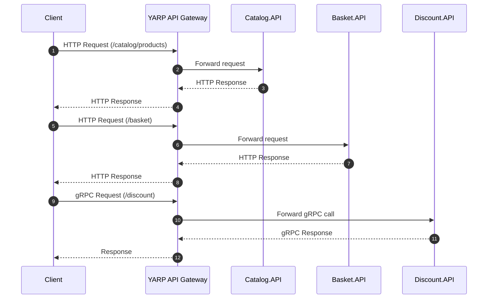

## ADR - Choix YARP comme API Gateway

### Contexte

L’architecture microservices nécessite un point d’entrée unique pour les clients (frontend, Postman, etc.) afin d’éviter l’exposition directe de chaque service et centraliser les préoccupations transverses.

### Options considérées

- Nginx / Traefik : Très performants, mais configuration externe et moins intégrés à .NET
- Ocelot : Spécifique .NET, mais moins maintenu et plus lourd
- YARP (Yet Another Reverse Proxy) : Solution officielle Microsoft, intégration native ASP.NET Core

### Décision

Choix de **YARP** comme API Gateway :

- Intégration native avec ASP.NET Core
- Configuration simple via `appsettings.json`
- Support du load balancing et du routing avancé
- Maintenu activement par Microsoft

### Conséquences

- La gateway devient un point critique à surveiller
- Nécessite une configuration rigoureuse des routes
- Facilite l’évolution future (auth, rate limiting)

### Diagramme de séquence – Routage via la Gateway

