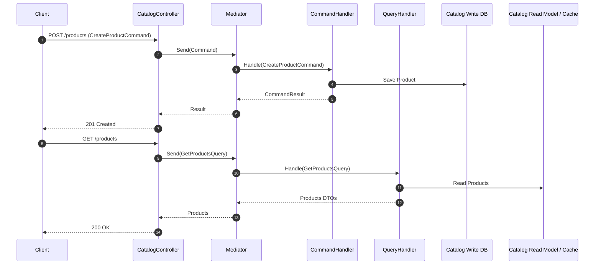
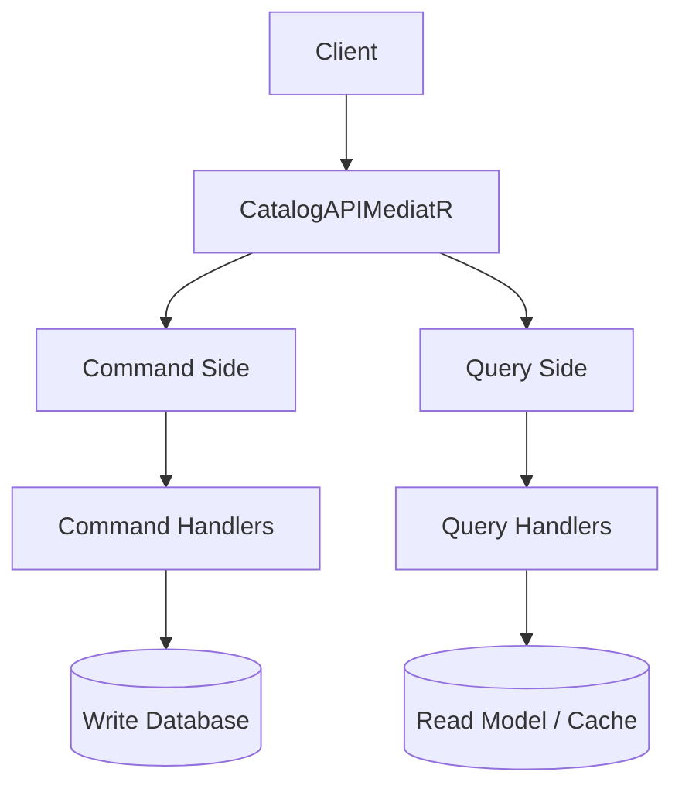

## ADR – CQRS pour Catalog

### Contexte

Le service Catalog gère un grand nombre de produits avec des opérations en lecture fréquentes et des opérations en écriture moins fréquentes.

### Options considérées

- CRUD classique sans CQRS : Pas de séparation lecture et écriture
- CQRS (Command Query Responsibility Segregation) : Séparation des commandes (Write) et des requêtes (Read), Permet d’optimiser la lecture indépendamment de l’écriture

### Décision

Choix CQRS pour le service Catalog :

- Séparation claire entre lecture et écriture
- Facilite l’ajout de validations et règles métiers spécifiques aux commandes
- Permet d’utiliser différents modèles de lecture/écriture si besoin (ex : cache)

### Conséquences

- Plus de code et de concepts à comprendre pour les développeurs
- Besoin d’implémenter des patterns comme Mediator, Handlers
- Gain en flexibilité et évolutivité pour le service Catalog

### Diagramme de séquence – Flux CQRS (Write & Read séparés)

### Diagramme de composants – Séparation Read / Write

