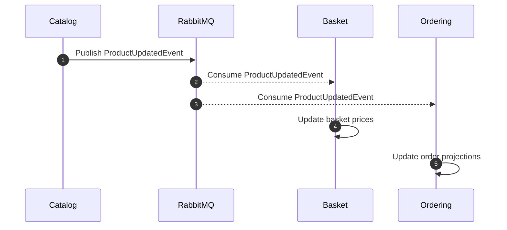
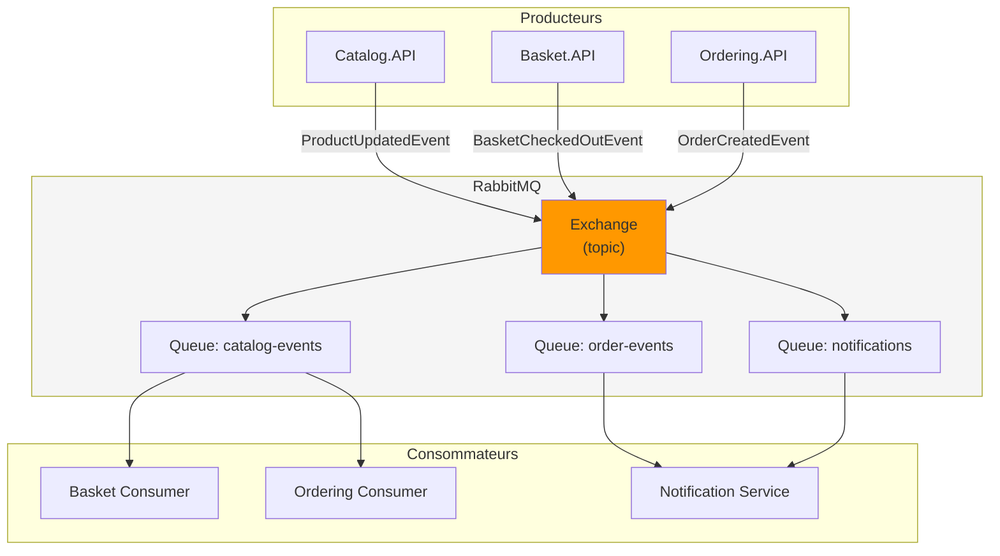
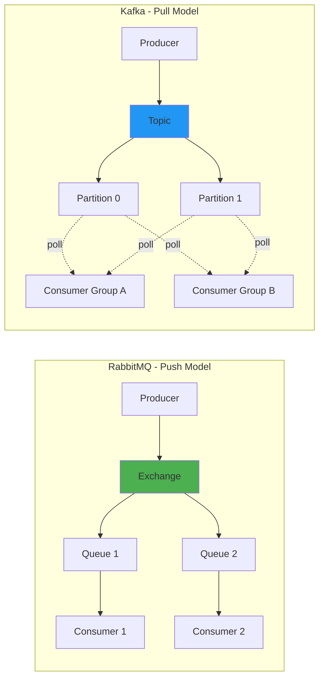

## ADR - Architecture événementielle avec RabbitMQ

### Contexte

Les microservices de l'e-shop (Catalog, Basket, Ordering, Discount) doivent communiquer entre eux sans créer de dépendances fortes et permettre une meilleure resilience du systeme. Le choix du pattern de communication et du broker de messages impacte directement les performances, la scalabilite et la complexité operationnelle.

### Options considerees

**Patterns de communication :**

- **Appels synchrones HTTP/REST** : Simples mais fortement couples et sensibles aux pannes
- **gRPC synchrone** : Très performant mais toujours couplé temporellement
- **Event-driven asynchrone** : Communication decouplée via un broker de messages

**Brokers de messages :**

- **RabbitMQ** : Broker de messages traditionnel implémentant AMQP, orienté message queuing avec routage flexible
- **Apache Kafka** : Plateforme de streaming distribue, orienté event log avec réstention et replay des evenements

### Comparaison RabbitMQ vs Kafka

| Critère                   | RabbitMQ                                     | Apache Kafka                                      |
| ------------------------- | -------------------------------------------- | ------------------------------------------------- |
| Modèle                    | Message Queue (push)                         | Event Log / Streaming (pull)                      |
| Protocole                 | AMQP, MQTT, STOMP                            | Protocole binaire propriétaire                    |
| Debit                     | ~50K msg/sec par noeud                       | ~1M+ msg/sec par partition                        |
| Latence                   | Très faible (~1ms)                           | Faible (~5-10ms)                                  |
| Rétention                 | Supprime après consommation                  | Conserve selon rétention (jours/semaines)         |
| Replay                    | Non natif                                    | Natif (consumer offset)                           |
| Routage                   | Flexible (exchanges, bindings, routing keys) | Limite (topics, partitions)                       |
| Ordre des messages        | Par queue                                    | Par partition uniquement                          |
| Scalabilité               | Verticale + clustering                       | Horizontale native (partitions)                   |
| Complexité operationnelle | Moderée                                      | Elevée (ZooKeeper/KRaft, partitions, replication) |
| Ecosystème .NET           | MassTransit, EasyNetQ, RabbitMQ.Client       | Confluent.Kafka                                   |
| Cas d'usage idéal         | Taches asynchrones, RPC, routage complexe    | Event sourcing, analytics, haute volumetrie       |

### Analyse des besoins e-shop

| Besoin                                                      | RabbitMQ                        | Kafka                               |
| ----------------------------------------------------------- | ------------------------------- | ----------------------------------- |
| Communication inter-services (ProductUpdated, OrderCreated) | Adapte                          | Sur-dimensionné                     |
| Volume de messages (~100-1000 msg/sec estime)               | Adapte                          | Sur-dimensionné                     |
| Patterns pub/sub simples                                    | Adapte (exchanges fanout/topic) | Adapte                              |
| Routage conditionnel (ex: par type de produit)              | Excellent (routing keys)        | Limite                              |
| Replay d'événements pour debug/audit                        | Non natif                       | Excellent                           |
| Complexite d'infrastructure acceptable                      | Simple (1 conteneur Docker)     | Complexe (broker + ZooKeeper/KRaft) |

### Decision

Choix d'une **architecture événementielle avec RabbitMQ** :

1. **Decouplage fort** : Les producteurs et consommateurs n'ont pas besoin de se connaitre, communication via événements
2. **Resilience** : Les messages sont persistes dans les queues en cas de panne d'un consommateur
3. **Adequation au volume** : Le volume de messages d'un e-shop reste modeste, RabbitMQ gere facilement ce debit
4. **Simplicité operationnelle** : Un seul conteneur Docker avec UI de management integree
5. **Latence optimale** : Sub-milliseconde, idéale pour les workflows e-commerce temps réel
6. **Routage flexible**
7. **Ecosystème .NET mature** : MassTransit offre des patterns avances (sagas, outbox, retry)

### Quand préferer Kafka ?

Kafka serait un meilleur choix si :

- Volume > 100K messages/seconde soutenu
- Besoin de replay d'événements (event sourcing, audit complet)
- Intégration avec un data lake ou pipeline analytics
- Consumers multiples devant lire les mêmes événements à des vitesses différentes

### Conséquences

**Positives :**

- Découplage fort entre services, évolution independante
- Résilience face aux pannes temporaires
- Infrastructure simple et legère (~128MB RAM)
- Interface de management web pour monitoring
- Patterns de retry, dead-letter et acknowledgment natifs

**Negatives :**

- Complexité accrue par rapport aux appels synchrones
- Débogage plus complexe (flux asynchrones)
- Pas de replay natif des événements (nécessite un pattern outbox/event store separe)
- Nécessite une surveillance (queues, consumers)

### Diagramme de séquence - Publication et consommation d'événements

### Diagramme d'architecture

### Comparaison des topologies RabbitMQ vs Kafka

