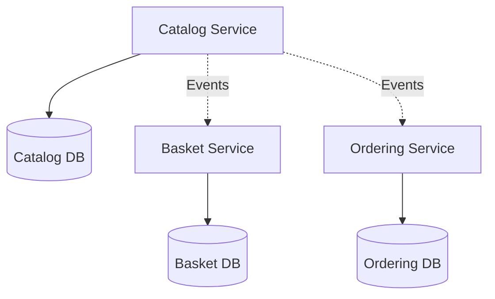

## ADR – Base de données par service

### Contexte

Chaque microservice possède son propre domaine métier et évolue indépendamment des autres.

### Options considérées

- Base de données partagée : Simple au départ mais fortement couplée
- Base de données par service : Isolation totale des données

### Décision

Choix **Database par Service** :

- Indépendance totale des services
- Possibilité de choisir le type de base le plus adapté par service
- Évolution du schéma sans impacter les autres services

### Conséquences

- Impossibilité de jointures inter-services
- Gestion de la cohérence via événements
- Plus de bases à administrer

### Diagramme de composants – Isolation des bases de données

