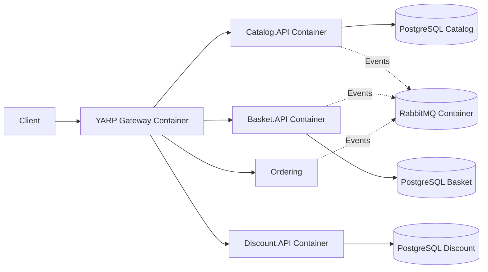

## ADR – Conteneurisation avec Docker

### Contexte

Le projet doit être facilement déployable, reproductible sur différentes machines et compatible avec des environnements CI/CD.

### Options considérées

- Déploiement manuel sur serveur
- Machines virtuelles
- Conteneurisation Docker

### Décision

Choix de la **conteneurisation avec Docker** :

- Environnement identique entre développement et production
- Démarrage rapide des services
- Intégration naturelle avec Docker Compose et Kubernetes
- Facilite le scaling horizontal

### Conséquences

- Courbe d’apprentissage Docker
- Nécessite une gestion réseau entre conteneurs
- Problèmes possibles liés au DNS ou au réseau

