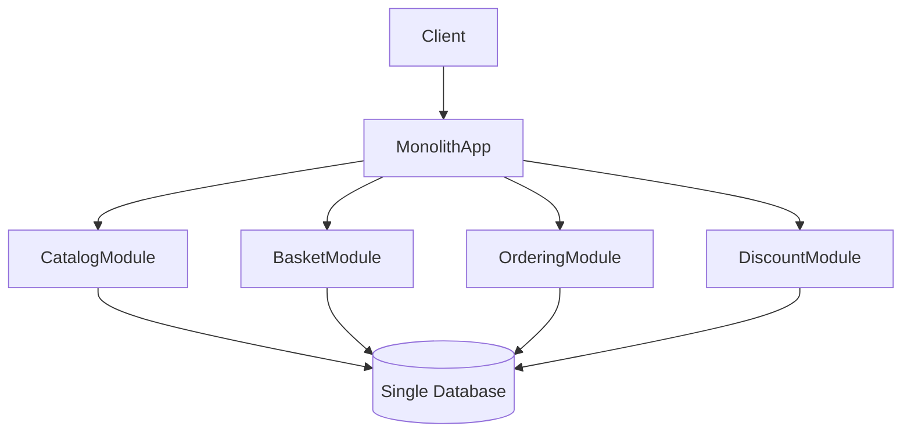
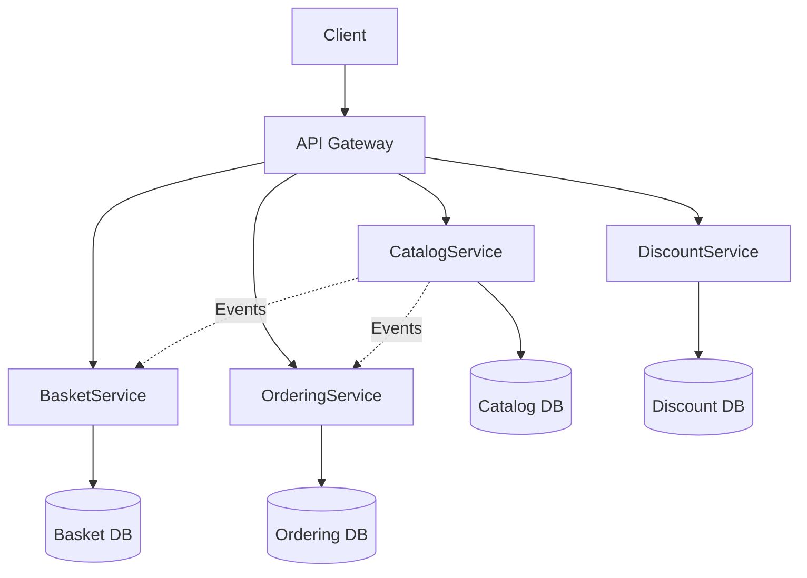

## ADR – Microservices vs Monolithique

### Contexte

Le projet eShop doit gérer plusieurs domaines : Catalog, Basket, Ordering, Discount.
L’équipe souhaite pouvoir scaler indépendamment chaque domaine et faciliter les déploiements.

### Options considérées

- Monolithique : Tous les domaines dans un seul projet, Déploiement unique

- Microservices : Un service par domaine, Déploiement indépendant, Communication via HTTP/gRPC

### Décision

Choix Microservices pour les raisons suivantes :

- Scalabilité indépendante des services (ex : Catalog peut scaler sans toucher Basket)
- Isolation des domaines pour faciliter la maintenance
- Possibilité de déployer / mettre à jour un service sans impacter les autres

### Conséquences

- Plus de complexité dans l’infrastructure (orchestration Docker / réseau)
- Besoin de gestion centralisée des logs et de monitoring
- Chaque service doit avoir sa propre base de données
