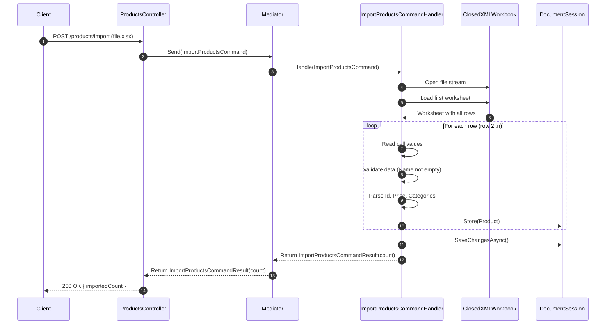

## ADR – Choix ClosedXML pour import/export Excel

### Contexte

Le service Catalog doit pouvoir importer et exporter des produits via des fichiers Excel.

### Options considérées

- EPPlus : Très mature, API riche, Licence commerciale stricte à partir de la v8
- ClosedXML : Open-source, Compatible .NET 6/7, API simple pour créer et lire Excel, Pas de licence à gérer

### Décision

Choix ClosedXML :

- Évite tous les problèmes de licence EPPlus 8+
- Fonctionne dans Docker et CI/CD sans configuration supplémentaire
- API simple pour import/export de produits

### Conséquences

- ClosedXML n’a pas toutes les fonctionnalités avancées d’EPPlus (ex: charting avancé)
- Suffisant pour import/export de données tabulaires

### Diagramme de séquence du fonctionnement de l’import de produits depuis un fichier Excel avec ClosedXML

