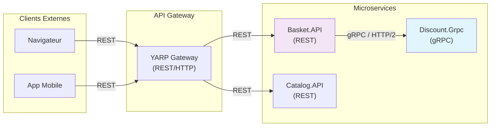

## ADR - gRPC vs REST pour le service Discount

### Contexte

Le service Discount fournit des operations CRUD sur les coupons de reduction et doit etre consomme principalement par le service Basket en communication synchrone interne (service-to-service). Le choix du protocole de communication impacte les performances, le couplage entre services et la maintenabilite.

### Options considerees

- **REST (HTTP/JSON)** : Standard web largement adopte, lisible par l'humain, outillage mature (Swagger/OpenAPI), routing base sur les URLs et verbes HTTP. Serialisation en JSON (texte).
- **gRPC (HTTP/2 + Protobuf)** : Framework RPC haute performance de Google, contrat fort via fichiers `.proto`, serialisation binaire (Protobuf), support natif du streaming, generation automatique du code client/serveur.

### Comparaison

| Critere | REST (HTTP/JSON) | gRPC (HTTP/2 + Protobuf) |
| --- | --- | --- |
| Performance | Serialisation JSON textuelle, plus lent | Serialisation binaire Protobuf, ~10x plus rapide |
| Contrat | OpenAPI/Swagger (optionnel) | Fichier `.proto` (obligatoire, strict) |
| Typage | Faible (JSON non type) | Fort (Protobuf genere des classes typees) |
| Generation de code | Manuelle ou via outils tiers | Automatique (client et serveur) |
| Streaming | Limite (SSE, WebSocket) | Natif (unary, server/client/bidirectional streaming) |
| Compatibilite navigateur | Native | Necessite gRPC-Web ou un proxy |
| Debuggabilite | Facile (curl, Postman, lisible) | Plus difficile (binaire, necessite des outils specifiques) |
| Cas d'usage ideal | APIs publiques, client-serveur | Communication inter-services, haute performance |
| Support .NET | ASP.NET Core Web API | Grpc.AspNetCore (support natif) |

### Decision

**Choix : gRPC** pour la communication avec le service Discount.

Justifications :

1. **Communication inter-services uniquement** : Le service Discount n'est pas expose directement aux clients externes. Il est consomme exclusivement par d'autres microservices (Basket), ce qui elimine le besoin de compatibilite navigateur.

2. **Performance** : Chaque ajout d'article au panier declenche un appel au service Discount pour recuperer la remise applicable. La serialisation binaire Protobuf et le multiplexage HTTP/2 reduisent significativement la latence sur ces appels frequents.

3. **Contrat fort** : Le fichier `discount.proto` definit un contrat strict partage entre le serveur (Discount.Grpc) et le client (Basket.API). Toute modification du contrat est detectee a la compilation, evitant les erreurs a l'execution.

4. **Generation automatique du code** : Le client gRPC (`DiscountProtoService.DiscountProtoServiceClient`) est genere automatiquement a partir du fichier `.proto`, eliminant le code boilerplate et garantissant la coherence client/serveur.

5. **Support natif .NET** : ASP.NET Core 9.0 offre un support de premiere classe pour gRPC via `Grpc.AspNetCore`, avec integration dans le systeme d'injection de dependances.

### Consequences

**Positives :**
- Latence reduite sur les appels Basket → Discount grace a la serialisation binaire
- Contrat strict entre services, erreurs detectees a la compilation
- Code client genere automatiquement, moins de maintenance
- Possibilite d'evoluer vers du streaming si necessaire (ex: application de remises en lot)

**Negatives :**
- Le service Discount ne peut pas etre teste facilement via curl ou Postman (necessite des outils comme grpcurl ou BloomRPC)
- Le fichier `.proto` doit etre synchronise entre les projets Discount.Grpc et Basket.API
- L'ajout d'un consommateur non-.NET necessitera de generer un client gRPC dans le langage cible

### Diagramme de communication



### Contrat gRPC (discount.proto)

```protobuf
service DiscountProtoService {
  rpc GetDiscount (GetDiscountRequest) returns (CouponModel);
  rpc CreateDiscount (CreateDiscountRequest) returns (CouponModel);
  rpc UpdateDiscount (UpdateDiscountRequest) returns (CouponModel);
  rpc DeleteDiscount (DeleteDiscountRequest) returns (DeleteDiscountResponse);
}
```
