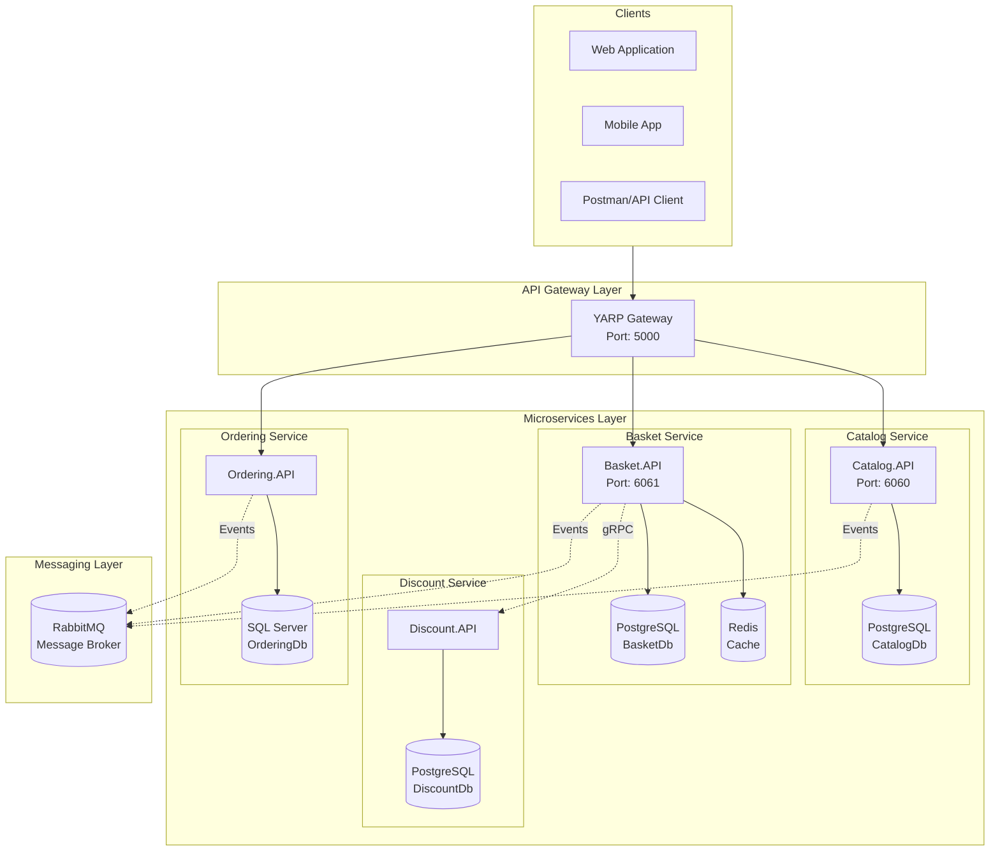
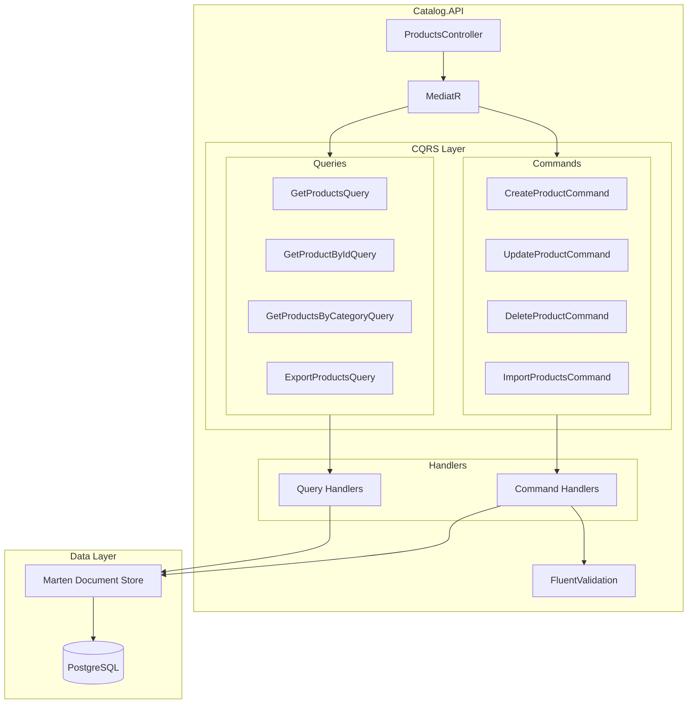
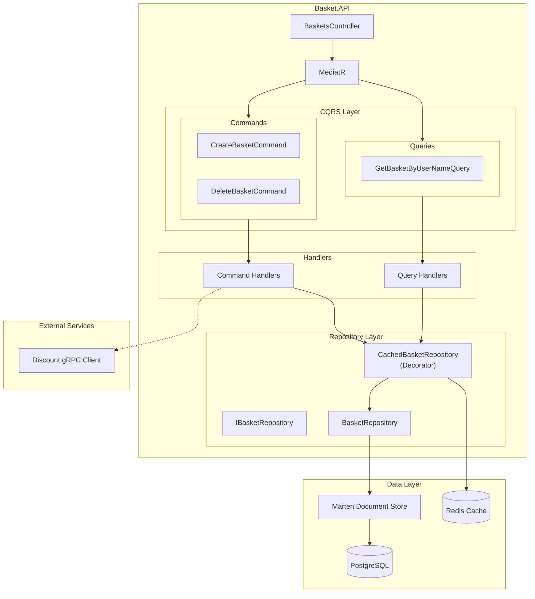
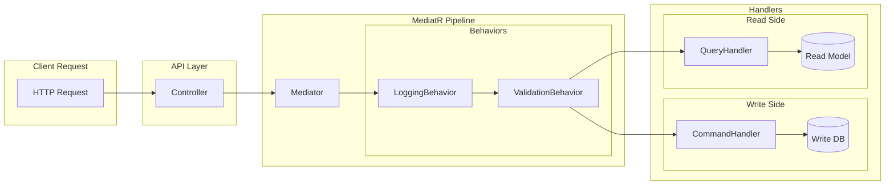
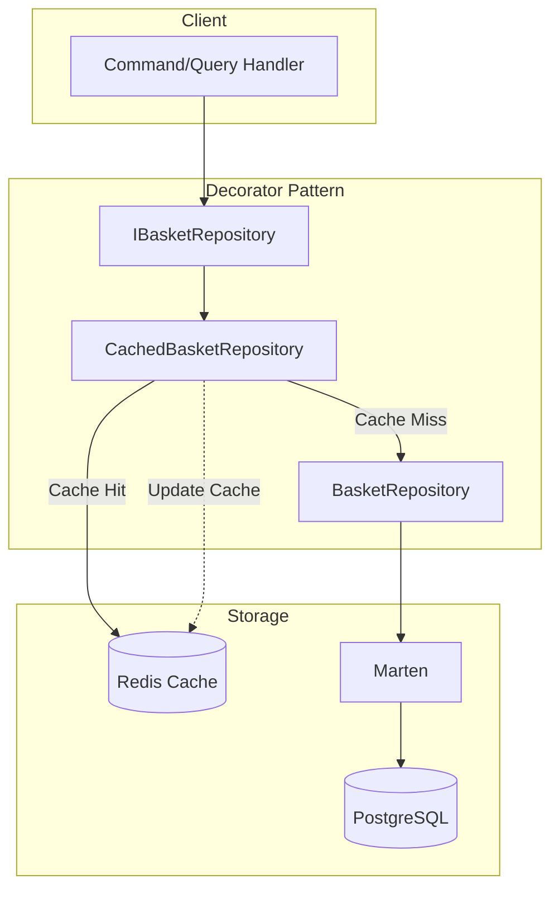
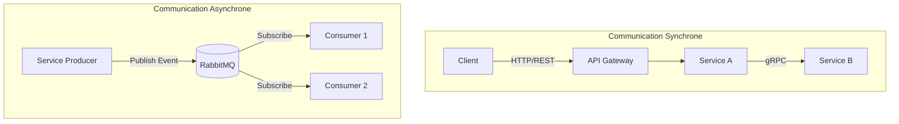
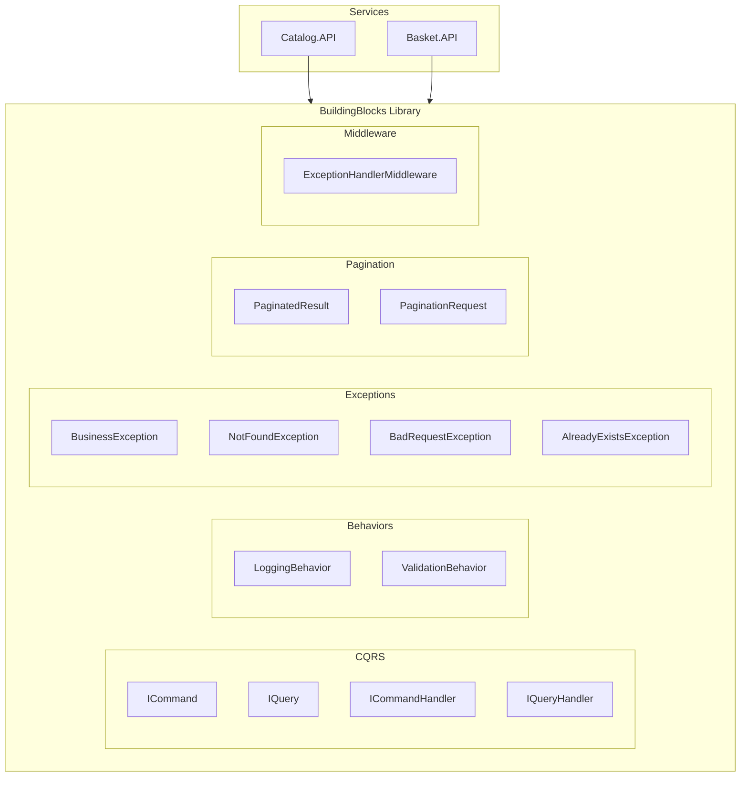

# Diagrammes de Composants - eShop

## Vue d'Ensemble des Services

## Architecture du Catalog Service

## Architecture du Basket Service

## Pattern CQRS avec MediatR

## Pattern Decorator - Cache Redis (Basket)

## Communication Inter-Services

## BuildingBlocks - Composants Partages

