# Flux de Donnees - eShop

## Vue d'Ensemble des Flux

Ce document decrit les principaux flux de donnees entre les services de l'application eShop.

## Flux Principal - Parcours Client

## Flux CRUD - Catalog Service

### Creation d'un Produit

### Lecture des Produits (avec Pagination)

### Import Excel

## Flux CRUD - Basket Service

### Creation/Mise a jour du Panier

### Lecture du Panier (avec Cache)

```mermaid
sequenceDiagram
    autonumber
    participant Client
    participant Controller as BasketsController
    participant Mediator as MediatR
    participant Handler as GetBasketHandler
    participant CachedRepo as CachedBasketRepository
    participant Redis as Redis Cache
    participant BaseRepo as BasketRepository
    participant Marten as Marten Session
    participant DB as PostgreSQL

    Client->>Controller: GET /baskets/{userName}
    Controller->>Mediator: Send(GetBasketQuery)
    Mediator->>Handler: Handle(query)
    Handler->>CachedRepo: GetBasket(userName)

    CachedRepo->>Redis: GET basket:{userName}

    alt Cache Hit
        Redis-->>CachedRepo: Cached basket
        CachedRepo-->>Handler: ShoppingCart
    else Cache Miss
        Redis-->>CachedRepo: null
        CachedRepo->>BaseRepo: GetBasket(userName)
        BaseRepo->>Marten: Query basket
        Marten->>DB: SELECT basket
        DB-->>Marten: Basket data
        Marten-->>BaseRepo: ShoppingCart
        BaseRepo-->>CachedRepo: ShoppingCart

        CachedRepo->>Redis: SET basket:{userName}
        Redis-->>CachedRepo: OK
        CachedRepo-->>Handler: ShoppingCart
    end

    Handler-->>Mediator: GetBasketResult
    Mediator-->>Controller: Result
    Controller-->>Client: 200 OK {basket}
```

## Flux Event-Driven (Planifie)

### Publication d'Evenements

### Integration Discount via gRPC

## Flux de Donnees par Base de Donnees

```mermaid
flowchart TB
    subgraph catalog_flow["Catalog Data Flow"]
        CatalogAPI["Catalog.API"]
        CatalogMarten["Marten Session"]
        CatalogDB[("PostgreSQL<br/>CatalogDb")]

        CatalogAPI -->|CRUD| CatalogMarten
        CatalogMarten -->|Document Store| CatalogDB
    end

    subgraph basket_flow["Basket Data Flow"]
        BasketAPI["Basket.API"]
        BasketCache["Redis Cache"]
        BasketMarten["Marten Session"]
        BasketDB[("PostgreSQL<br/>BasketDb")]

        BasketAPI -->|Read/Write| BasketCache
        BasketAPI -->|Persistence| BasketMarten
        BasketMarten -->|Document Store| BasketDB
    end

    subgraph event_flow["Event Flow (Planifié)"]
        Producer["Any Service"]
        RabbitMQ[("RabbitMQ")]
        Consumers["Subscribed Services"]

        Producer -->|Publish| RabbitMQ
        RabbitMQ -->|Subscribe| Consumers
    end

    catalog_flow ~~~ basket_flow
    basket_flow ~~~ event_flow

```

