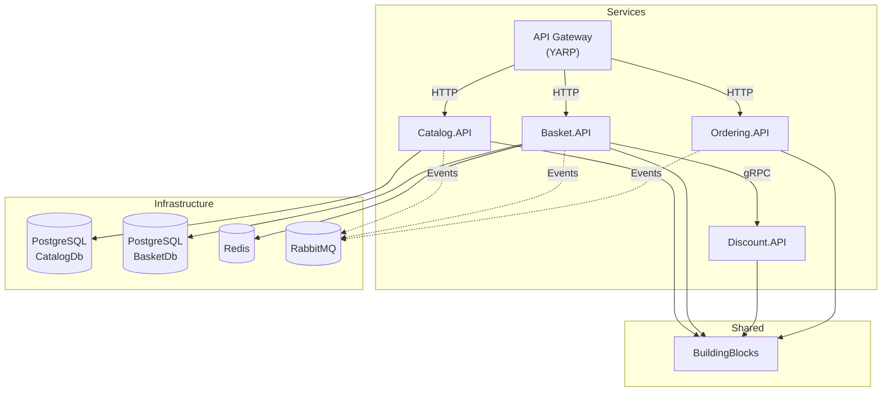

# Dependances et Packages - eShop

## Matrice des Dependances Inter-Services

## Dependances par Service

### Catalog.API

| Package                                        | Version | Usage                           |
| ---------------------------------------------- | ------- | ------------------------------- |
| Marten                                         | 8.3.1   | Document Store / Event Sourcing |
| MediatR                                        | 13.0.0  | CQRS / Mediator pattern         |
| FluentValidation.DependencyInjectionExtensions | 12.0.0  | Validation                      |
| Mapster                                        | 7.4.0   | Object mapping                  |
| ClosedXML                                      | 0.105.0 | Import/Export Excel             |
| AspNetCore.HealthChecks.NpgSql                 | -       | Health checks PostgreSQL        |
| AspNetCore.HealthChecks.UI.Client              | -       | Health UI                       |
| Microsoft.AspNetCore.OpenApi                   | -       | OpenAPI/Swagger                 |
| Microsoft.FeatureManagement.AspNetCore         | 4.2.1   | Feature flags                   |

### Basket.API

| Package                                         | Version | Usage                             |
| ----------------------------------------------- | ------- | --------------------------------- |
| Marten                                          | 8.3.2   | Document Store                    |
| MediatR                                         | 13.0.0  | CQRS / Mediator pattern           |
| FluentValidation.DependencyInjectionExtensions  | 12.0.0  | Validation                        |
| Mapster                                         | 7.4.0   | Object mapping                    |
| Microsoft.Extensions.Caching.StackExchangeRedis | -       | Redis caching                     |
| Grpc.AspNetCore                                 | 2.71.0  | gRPC client                       |
| Scrutor                                         | 6.1.0   | DI decoration (Decorator pattern) |
| AspNetCore.HealthChecks.NpgSql                  | -       | Health checks PostgreSQL          |
| AspNetCore.HealthChecks.Redis                   | -       | Health checks Redis               |
| AspNetCore.HealthChecks.UI.Client               | -       | Health UI                         |
| Microsoft.AspNetCore.OpenApi                    | -       | OpenAPI/Swagger                   |
| Microsoft.FeatureManagement.AspNetCore          | 4.2.1   | Feature flags                     |

### BuildingBlocks (Shared Library)

| Package                                   | Version | Usage                |
| ----------------------------------------- | ------- | -------------------- |
| MediatR                                   | 13.0.0  | Interfaces CQRS      |
| FluentValidation                          | 12.0.0  | Validation behavior  |
| Microsoft.Extensions.Logging.Abstractions | -       | Logging abstractions |
| Microsoft.AspNetCore.Http.Abstractions    | -       | HTTP context         |
| Microsoft.FeatureManagement.AspNetCore    | 4.2.1   | Feature management   |

## Dependances Infrastructure

### Bases de Donnees

| Service | Type       | Image Docker    | Port |
| ------- | ---------- | --------------- | ---- |
| Catalog | PostgreSQL | postgres:latest | 5432 |
| Basket  | PostgreSQL | postgres:latest | 5433 |
| Basket  | Redis      | redis:latest    | 6379 |

### Message Broker (Planifie)

| Service  | Type           | Port                            |
| -------- | -------------- | ------------------------------- |
| RabbitMQ | Message Broker | 5672 (AMQP), 15672 (Management) |

## Communication Inter-Services

| Source       | Destination  | Protocol   | Usage             |
| ------------ | ------------ | ---------- | ----------------- |
| Client       | API Gateway  | HTTP/HTTPS | API publique      |
| API Gateway  | Catalog.API  | HTTP       | Routage           |
| API Gateway  | Basket.API   | HTTP       | Routage           |
| API Gateway  | Ordering.API | HTTP       | Routage           |
| Basket.API   | Discount.API | gRPC       | Calcul remises    |
| All Services | RabbitMQ     | AMQP       | Events (planifie) |

## Versions du Framework

| Composant        | Version |
| ---------------- | ------- |
| .NET SDK         | 9.0     |
| ASP.NET Core     | 9.0     |
| C#               | 13.0    |
| Target Framework | net9.0  |

## Docker Images

| Service     | Base Image                          | Build Image                      |
| ----------- | ----------------------------------- | -------------------------------- |
| Catalog.API | mcr.microsoft.com/dotnet/aspnet:9.0 | mcr.microsoft.com/dotnet/sdk:9.0 |
| Basket.API  | mcr.microsoft.com/dotnet/aspnet:9.0 | mcr.microsoft.com/dotnet/sdk:9.0 |
| PostgreSQL  | postgres:latest                     | -                                |
| Redis       | redis:latest                        | -                                |
