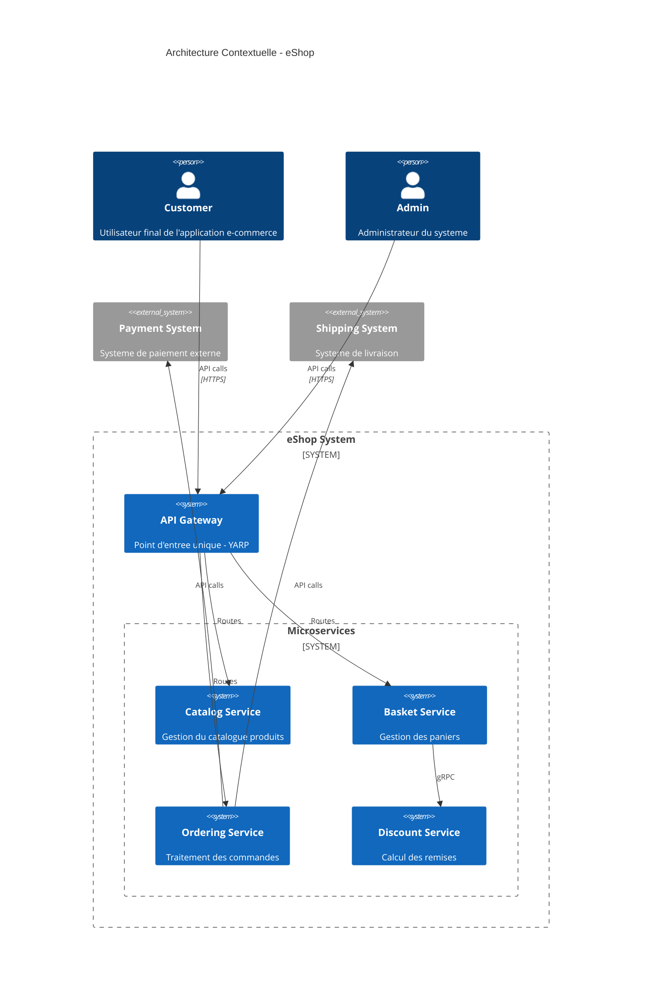

# Vue d'Ensemble Architecture - eShop

## Introduction

La solution eShop est une plateforme e-commerce implementee selon une architecture microservices moderne avec .NET 9. Elle suit les principes du Domain-Driven Design (DDD), CQRS (Command Query Responsibility Segregation), et Event-Driven Architecture.

## Objectifs Architecturaux

### Objectifs Metiers

| Objectif      | Description                          | Cible                              |
| ------------- | ------------------------------------ | ---------------------------------- |
| Scalabilite   | Support de la montee en charge       | Milliers d'utilisateurs simultanes |
| Disponibilite | Haute disponibilite du systeme       | 99.9% uptime                       |
| Performance   | Temps de reponse rapide              | < 200ms                            |
| Flexibilite   | Evolution rapide des fonctionnalites | Deploiements independants          |

### Objectifs Techniques

- **Maintenabilite** : Code modulaire, testable et bien documente
- **Observabilite** : Logging, metriques et tracing complets
- **Securite** : Protection des donnees et des API
- **Deployabilite** : CI/CD automatise avec Docker

## Architecture Globale



## Services de l'Ecosysteme

### Services Implementes

| Service     | Port | Base de Donnees     | Description                      |
| ----------- | ---- | ------------------- | -------------------------------- |
| Catalog.API | 6060 | PostgreSQL (Marten) | Gestion du catalogue produits    |
| Basket.API  | 6061 | PostgreSQL + Redis  | Gestion des paniers utilisateurs |

### Services Planifies

| Service      | Description                   | Statut   |
| ------------ | ----------------------------- | -------- |
| Discount.API | Calcul et gestion des remises | Planifie |
| Ordering.API | Traitement des commandes      | Planifie |
| API Gateway  | Routage centralise avec YARP  | Planifie |

## Stack Technique

### Backend

| Technologie      | Version | Usage                           |
| ---------------- | ------- | ------------------------------- |
| .NET             | 9.0     | Framework principal             |
| ASP.NET Core     | 9.0     | API REST                        |
| MediatR          | 13.0.0  | Pattern CQRS/Mediator           |
| Marten           | 8.3.x   | Document Store & Event Sourcing |
| FluentValidation | 12.0.0  | Validation des requetes         |

### Infrastructure

| Technologie    | Usage                      |
| -------------- | -------------------------- |
| PostgreSQL     | Base de donnees principale |
| Redis          | Cache distribue            |
| RabbitMQ       | Message broker (planifie)  |
| Docker         | Conteneurisation           |
| Docker Compose | Orchestration locale       |

### Communication Inter-Services

| Type       | Technologie | Usage                        |
| ---------- | ----------- | ---------------------------- |
| Synchrone  | HTTP/REST   | API publiques                |
| Synchrone  | gRPC        | Communication inter-services |
| Asynchrone | RabbitMQ    | Events domain (planifie)     |

## Principes Architecturaux

### 1. Database per Service

Chaque microservice possede sa propre base de donnees, garantissant :

- Independance des schemas
- Deploiements autonomes
- Choix technologique par service

### 2. CQRS (Command Query Responsibility Segregation)

Separation des operations de lecture et d'ecriture :

- **Commands** : Operations d'ecriture (Create, Update, Delete)
- **Queries** : Operations de lecture optimisees

### 3. Event-Driven Architecture

Communication asynchrone via evenements :

- Decouplage des services
- Resilience aux pannes
- Scalabilite horizontale

### 4. API Gateway Pattern

Point d'entree unique pour tous les clients :

- Routage centralise
- Cross-cutting concerns (auth, logging, rate limiting)
- Abstraction des services internes

## Structure du Projet

```
eshop-ynov/
├── src/
│   ├── eshop.services/           # Microservices
│   │   ├── catalog/              # Service Catalog
│   │   │   └── Catalog.API/
│   │   ├── basket/               # Service Basket
│   │   │   └── Basket.API/
│   │   ├── discount/             # Service Discount (planifie)
│   │   ├── ordering/             # Service Ordering (planifie)
│   │   └── gateway/              # API Gateway (planifie)
│   ├── eshop.shared/             # Code partage
│   │   └── blocks/BuildingBlocks/
│   ├── compose.yaml              # Docker Compose
│   ├── compose.override.yaml     # Overrides dev
│   └── .env                      # Variables d'environnement
├── docs/                         # Documentation
│   ├── adr/                      # Architecture Decision Records
│   ├── architecture/             # Documentation architecture
│   ├── deployment/               # Documentation deploiement
│   └── services/                 # Documentation par service
└── Eshop.postman_collection.json # Collection Postman
```
