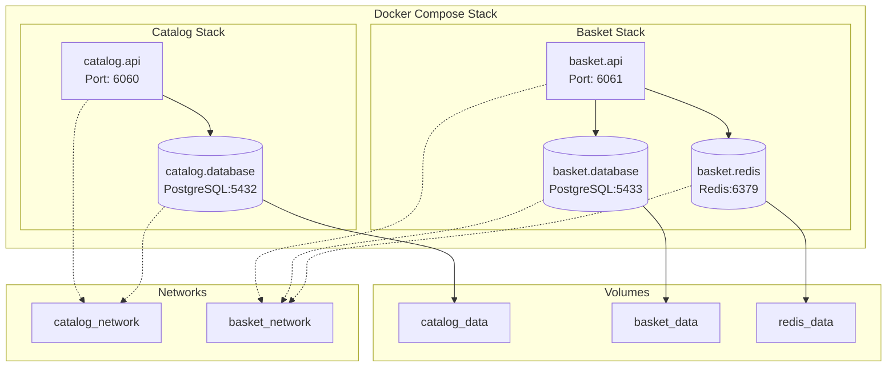
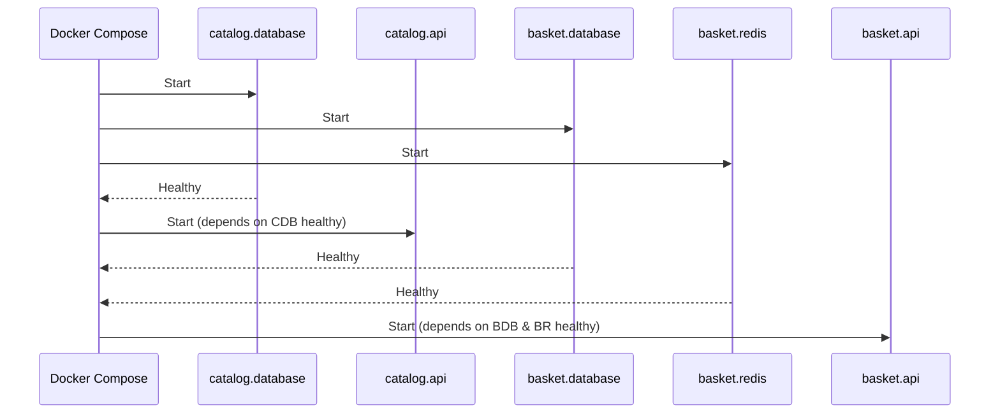

# Docker Compose - eShop

## Vue d'Ensemble

L'application eShop utilise Docker Compose pour orchestrer les differents services en environnement de developpement. Cette configuration permet de demarrer l'ensemble de l'infrastructure en une seule commande.

## Architecture des Conteneurs



## Fichiers de Configuration

### compose.yaml (Base)

```yaml
services:
  ### Service Catalog ###
  catalog.database:
    image: postgres:latest
    container_name: catalog_database
    networks:
      - catalog_network

  catalog.api:
    image: catalog.api
    container_name: catalog_api
    build:
      context: .
      dockerfile: eShop.services/catalog/Catalog.API/Dockerfile
    networks:
      - catalog_network
    depends_on:
      catalog.database:
        condition: service_healthy
        required: true
        restart: true

  ### Service Basket ###
  basket.database:
    image: postgres:latest
    container_name: basket_database
    networks:
      - basket_network

  basket.redis:
    image: redis:latest
    container_name: basket_redis
    networks:
      - basket_network

  basket.api:
    image: basket.api
    container_name: basket_api
    build:
      context: .
      dockerfile: eshop.services/basket/Basket.API/Dockerfile
    networks:
      - basket_network
    depends_on:
      basket.database:
        condition: service_healthy
      basket.redis:
        condition: service_healthy

volumes:
  catalog_data:
  basket_data:
  redis_data:

networks:
  catalog_network:
  basket_network:
```

### compose.override.yaml (Developpement)

```yaml
services:
  ### Service Catalog ###
  catalog.database:
    restart: always
    shm_size: 128mb
    ports:
      - "${CATALOG_POSTGRES_PORT}:5432"
    volumes:
      - catalog_data:/var/lib/postgresql
    environment:
      POSTGRES_PASSWORD: ${CATALOG_POSTGRES_PASSWORD}
      POSTGRES_USER: ${CATALOG_POSTGRES_USER}
      POSTGRES_DB: ${CATALOG_POSTGRES_DB}
    healthcheck:
      test:
        [
          "CMD-SHELL",
          "pg_isready -U ${CATALOG_POSTGRES_USER} -d ${CATALOG_POSTGRES_DB}",
        ]
      interval: 5s
      timeout: 5s
      retries: 5

  catalog.api:
    ports:
      - "6060:${CATALOG_API_PORT}"
    environment:
      - ASPNETCORE_HTTP_PORTS=${CATALOG_API_PORT}
      - ConnectionStrings__CatalogConnection=Server=catalog.database;Port=5432;...

  ### Service Basket ###
  basket.database:
    restart: always
    shm_size: 128mb
    ports:
      - "${BASKET_POSTGRES_PORT}:5432"
    volumes:
      - basket_data:/var/lib/postgresql
    environment:
      POSTGRES_PASSWORD: ${BASKET_POSTGRES_PASSWORD}
      POSTGRES_USER: ${BASKET_POSTGRES_USER}
      POSTGRES_DB: ${BASKET_POSTGRES_DB}
    healthcheck:
      test:
        [
          "CMD-SHELL",
          "pg_isready -U ${BASKET_POSTGRES_USER} -d ${BASKET_POSTGRES_DB}",
        ]
      interval: 5s
      timeout: 5s
      retries: 5

  basket.redis:
    restart: always
    ports:
      - "${BASKET_REDIS_PORT}:6379"
    volumes:
      - redis_data:/data
    healthcheck:
      test: ["CMD", "redis-cli", "ping"]
      interval: 10s
      timeout: 3s
      retries: 3

  basket.api:
    ports:
      - "6061:${BASKET_API_PORT}"
    environment:
      - ASPNETCORE_HTTP_PORTS=${BASKET_API_PORT}
      - ConnectionStrings__BasketConnection=Server=basket.database;Port=5432;...
      - ConnectionStrings__RedisConnection=basket.redis:6379
```

## Commandes Docker Compose

### Demarrage

```bash
# Demarrer tous les services
cd src
docker-compose up -d

# Demarrer avec rebuild des images
docker-compose up -d --build

# Demarrer un service specifique
docker-compose up -d catalog.api
```

### Arret

```bash
# Arreter tous les services
docker-compose down

# Arreter et supprimer les volumes
docker-compose down -v

# Arreter un service specifique
docker-compose stop catalog.api
```

### Logs

```bash
# Voir les logs de tous les services
docker-compose logs

# Suivre les logs en temps reel
docker-compose logs -f

# Logs d'un service specifique
docker-compose logs -f catalog.api
```

### Maintenance

```bash
# Voir l'etat des services
docker-compose ps

# Reconstruire une image
docker-compose build catalog.api

# Supprimer les conteneurs arretes
docker-compose rm

# Executer une commande dans un conteneur
docker-compose exec catalog.api bash
```

## Configuration des Services

### Catalog Service

| Parametre    | Valeur           |
| ------------ | ---------------- |
| Container    | catalog_api      |
| Port expose  | 6060             |
| Port interne | 6060             |
| Network      | catalog_network  |
| Dependance   | catalog.database |

### Catalog Database

| Parametre   | Valeur           |
| ----------- | ---------------- |
| Container   | catalog_database |
| Image       | postgres:latest  |
| Port expose | 5432             |
| Volume      | catalog_data     |
| Database    | CatalogDb        |

### Basket Service

| Parametre    | Valeur                        |
| ------------ | ----------------------------- |
| Container    | basket_api                    |
| Port expose  | 6061                          |
| Port interne | 6061                          |
| Network      | basket_network                |
| Dependances  | basket.database, basket.redis |

### Basket Database

| Parametre   | Valeur          |
| ----------- | --------------- |
| Container   | basket_database |
| Image       | postgres:latest |
| Port expose | 5433            |
| Volume      | basket_data     |
| Database    | BasketDb        |

### Basket Redis

| Parametre   | Valeur       |
| ----------- | ------------ |
| Container   | basket_redis |
| Image       | redis:latest |
| Port expose | 6379         |
| Volume      | redis_data   |

## Health Checks

### PostgreSQL

```yaml
healthcheck:
  test: ["CMD-SHELL", "pg_isready -U ${USER} -d ${DB}"]
  interval: 5s
  timeout: 5s
  retries: 5
```

### Redis

```yaml
healthcheck:
  test: ["CMD", "redis-cli", "ping"]
  interval: 10s
  timeout: 3s
  retries: 3
```

## Depends On - Ordre de Demarrage


