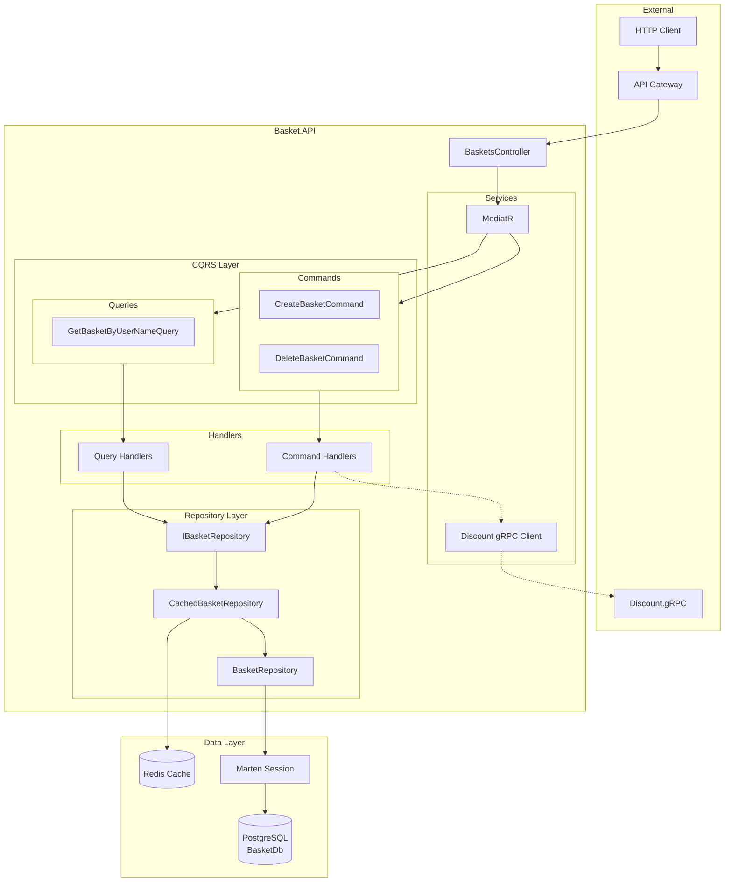
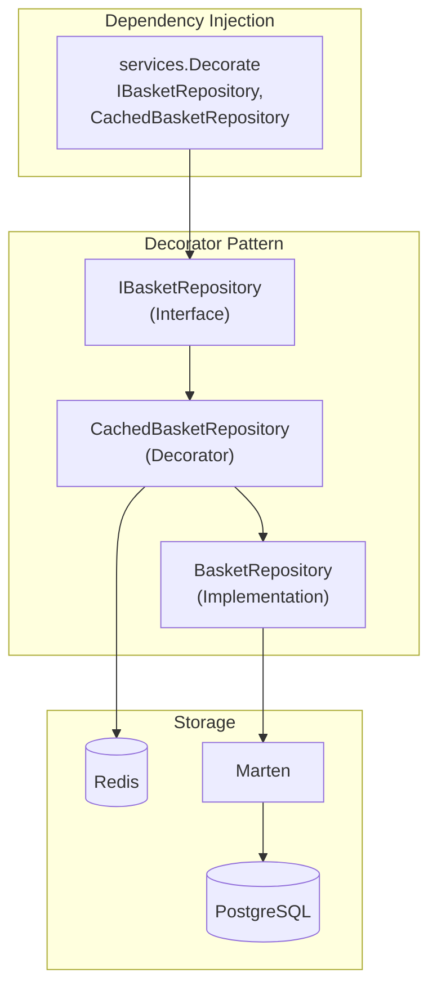
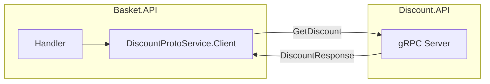
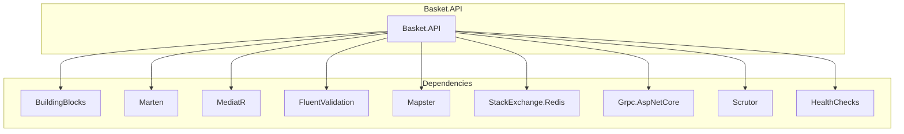

# Basket Service - Architecture des Composants

## Vue d'Ensemble

Le Basket Service gere les paniers d'achat des utilisateurs. Il utilise une architecture CQRS avec MediatR, un pattern Decorator pour le cache Redis, et gRPC pour communiquer avec le service Discount.

## Architecture Globale



## Structure des Dossiers

```
Basket.API/
├── Controllers/
│   └── BasketsController.cs
├── Features/
│   └── Baskets/
│       ├── Commands/
│       │   ├── CreateBasket/
│       │   │   ├── CreateBasketCommand.cs
│       │   │   ├── CreateBasketHandler.cs
│       │   │   └── CreateBasketValidator.cs
│       │   └── DeleteBasket/
│       │       ├── DeleteBasketCommand.cs
│       │       └── DeleteBasketHandler.cs
│       └── Queries/
│           └── GetBasketByUserName/
│               ├── GetBasketByUserNameQuery.cs
│               └── GetBasketByUserNameHandler.cs
├── Models/
│   ├── ShoppingCart.cs
│   └── ShoppingCartItem.cs
├── Data/
│   └── Repositories/
│       ├── IBasketRepository.cs
│       ├── BasketRepository.cs
│       └── CachedBasketRepository.cs
├── Extensions/
│   └── ServiceCollectionExtensions.cs
├── Program.cs
├── Dockerfile
└── appsettings.json
```

## Composants Principaux

### BasketsController

Point d'entree HTTP pour les operations sur les paniers.

```csharp
[ApiController]
[Route("[controller]")]
public class BasketsController : ControllerBase
{
    private readonly ISender _sender;

    // GET /baskets/{userName}
    // POST /baskets/{userName}
    // DELETE /baskets/{userName}
}
```

### Modeles

#### ShoppingCart

```csharp
public class ShoppingCart
{
    public string UserName { get; set; } = string.Empty;
    public IEnumerable<ShoppingCartItem> Items { get; set; } = [];

    public decimal Total => Items.Sum(x => x.Price * x.Quantity);
}
```

#### ShoppingCartItem

```csharp
public class ShoppingCartItem
{
    public int Quantity { get; set; }
    public string Color { get; set; } = string.Empty;
    public string ProductName { get; set; } = string.Empty;
    public decimal Price { get; set; }
    public Guid ProductId { get; set; }
}
```

## Pattern Decorator - Cache Redis

Le service utilise le pattern Decorator pour implementer le cache Redis de maniere transparente.



### IBasketRepository

```csharp
public interface IBasketRepository
{
    Task<ShoppingCart?> GetBasket(string userName, CancellationToken ct);
    Task<ShoppingCart> StoreBasket(ShoppingCart cart, CancellationToken ct);
    Task<bool> DeleteBasket(string userName, CancellationToken ct);
}
```

### BasketRepository

```csharp
public class BasketRepository : IBasketRepository
{
    private readonly IDocumentSession _session;

    public async Task<ShoppingCart?> GetBasket(string userName, CancellationToken ct)
    {
        return await _session.LoadAsync<ShoppingCart>(userName, ct);
    }

    public async Task<ShoppingCart> StoreBasket(ShoppingCart cart, CancellationToken ct)
    {
        _session.Store(cart);
        await _session.SaveChangesAsync(ct);
        return cart;
    }

    public async Task<bool> DeleteBasket(string userName, CancellationToken ct)
    {
        _session.Delete<ShoppingCart>(userName);
        await _session.SaveChangesAsync(ct);
        return true;
    }
}
```

### CachedBasketRepository

```csharp
public class CachedBasketRepository : IBasketRepository
{
    private readonly IBasketRepository _repository;
    private readonly IDistributedCache _cache;

    public async Task<ShoppingCart?> GetBasket(string userName, CancellationToken ct)
    {
        // 1. Try cache
        var cached = await _cache.GetStringAsync(userName, ct);
        if (cached != null)
            return JsonSerializer.Deserialize<ShoppingCart>(cached);

        // 2. Fallback to repository
        var basket = await _repository.GetBasket(userName, ct);

        // 3. Update cache
        if (basket != null)
            await _cache.SetStringAsync(userName, JsonSerializer.Serialize(basket), ct);

        return basket;
    }

    public async Task<ShoppingCart> StoreBasket(ShoppingCart cart, CancellationToken ct)
    {
        // 1. Store in repository
        var result = await _repository.StoreBasket(cart, ct);

        // 2. Update cache
        await _cache.SetStringAsync(cart.UserName, JsonSerializer.Serialize(result), ct);

        return result;
    }

    public async Task<bool> DeleteBasket(string userName, CancellationToken ct)
    {
        // 1. Delete from repository
        var result = await _repository.DeleteBasket(userName, ct);

        // 2. Invalidate cache
        await _cache.RemoveAsync(userName, ct);

        return result;
    }
}
```

## Commands et Handlers

### CreateBasketCommand

| Propriete | Type                   | Requis |
| --------- | ---------------------- | ------ |
| UserName  | string                 | Oui    |
| Items     | List<ShoppingCartItem> | Oui    |

### DeleteBasketCommand

| Propriete | Type   | Requis |
| --------- | ------ | ------ |
| UserName  | string | Oui    |

## Queries et Handlers

### GetBasketByUserNameQuery

| Propriete | Type   | Requis |
| --------- | ------ | ------ |
| UserName  | string | Oui    |

**Resultat** : `ShoppingCart` ou `NotFoundException`

## Integration gRPC (Discount Service)



### Configuration gRPC

```csharp
// Program.cs
builder.Services.AddGrpcClient<DiscountProtoService.DiscountProtoServiceClient>(options =>
{
    options.Address = new Uri(discountUrl);
});
```

## Dependances



## Configuration

### appsettings.json

```json
{
  "ConnectionStrings": {
    "BasketConnection": "Server=basket.database;Port=5432;Database=BasketDb;...",
    "RedisConnection": "basket.redis:6379"
  },
  "GrpcSettings": {
    "DiscountUrl": "http://discount.api:6062"
  }
}
```

### Program.cs (Services)

```csharp
// Marten
builder.Services.AddMarten(options =>
{
    options.Connection(connectionString);
    options.Schema.For<ShoppingCart>().Identity(x => x.UserName);
}).UseLightweightSessions();

// Redis Cache
builder.Services.AddStackExchangeRedisCache(options =>
{
    options.Configuration = redisConnection;
});

// Repository with Decorator
builder.Services.AddScoped<IBasketRepository, BasketRepository>();
builder.Services.Decorate<IBasketRepository, CachedBasketRepository>();

// gRPC Client
builder.Services.AddGrpcClient<DiscountProtoService.DiscountProtoServiceClient>(...);

// Health Checks
builder.Services.AddHealthChecks()
    .AddNpgSql(connectionString)
    .AddRedis(redisConnection);
```
