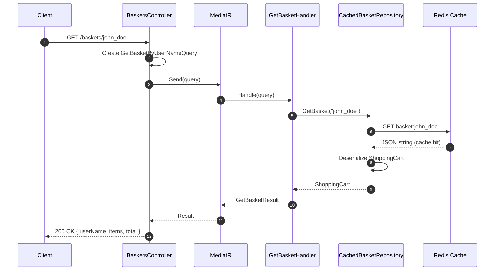
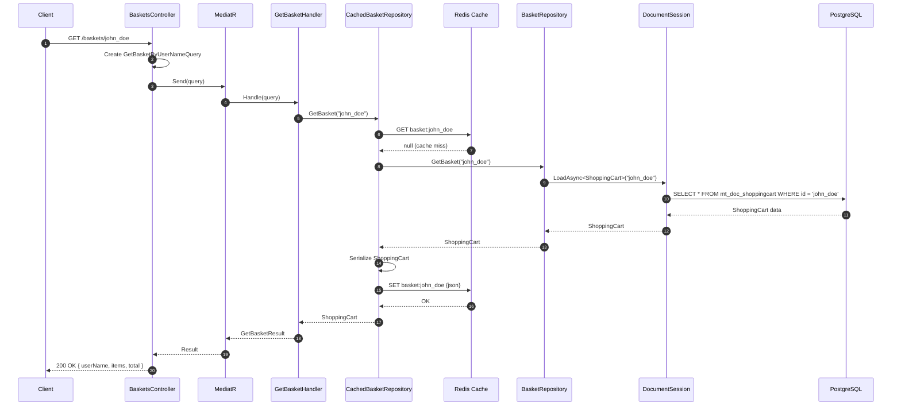
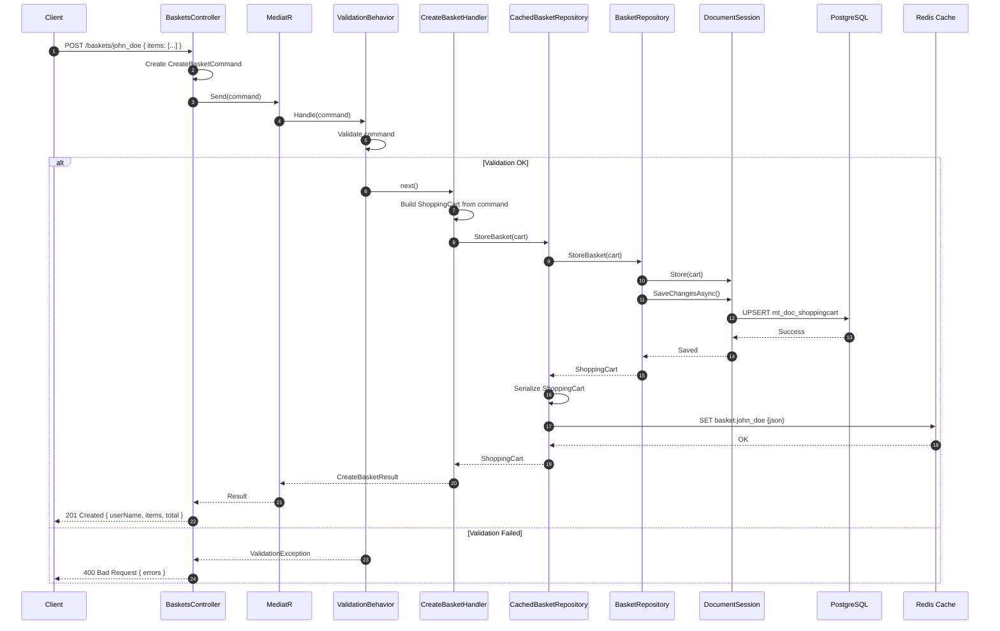
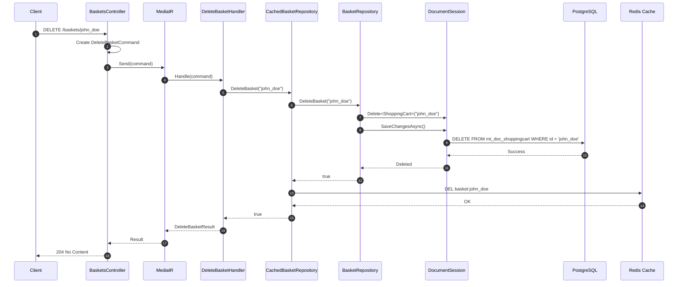
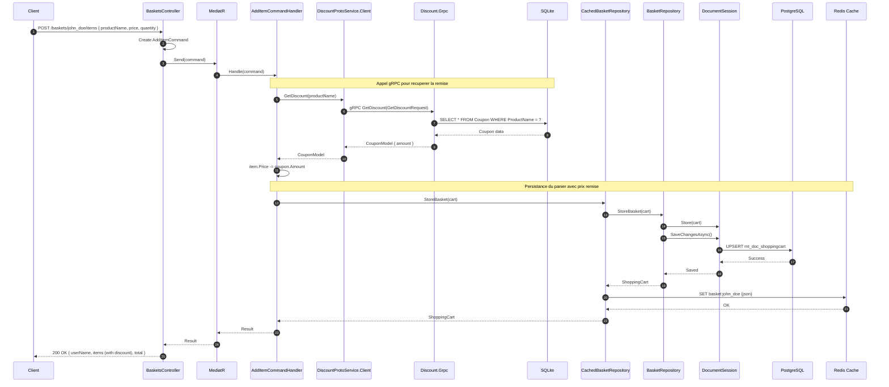
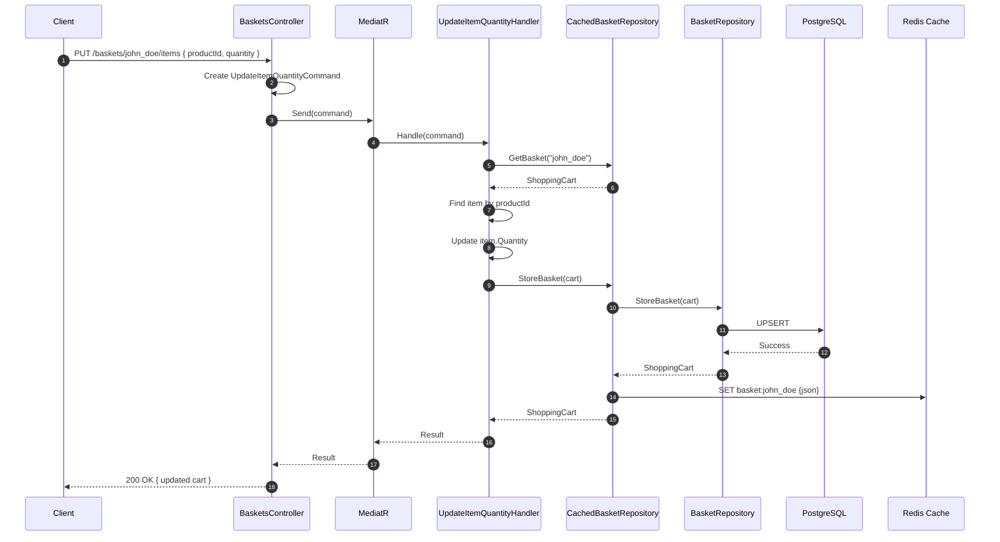
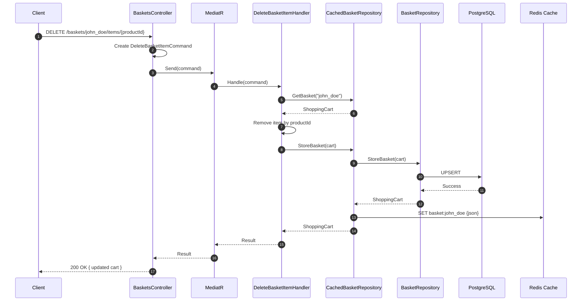
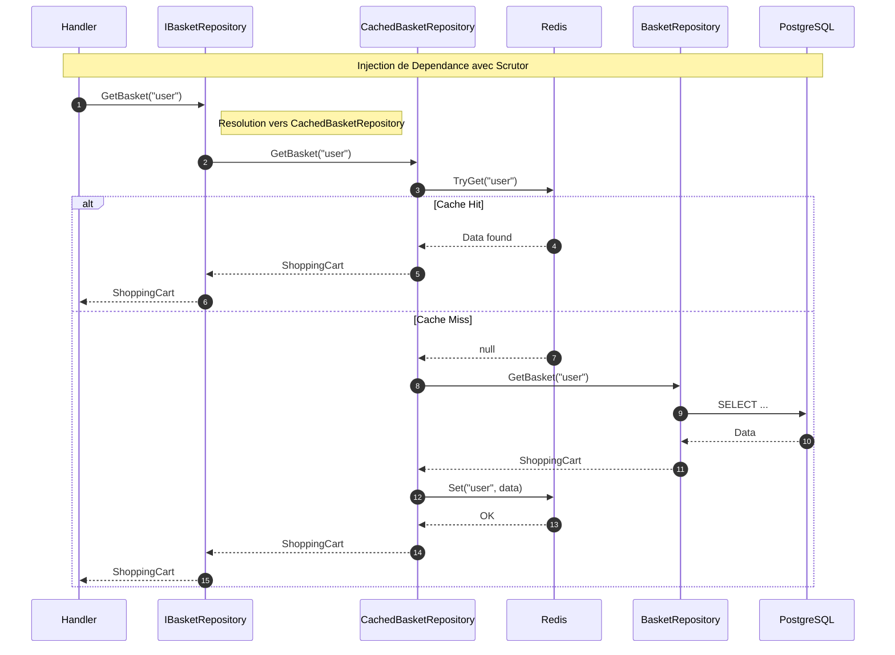
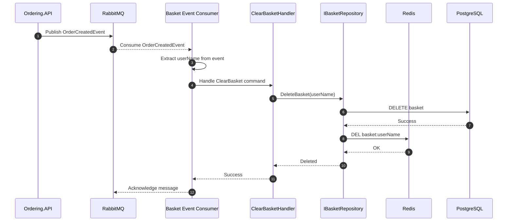
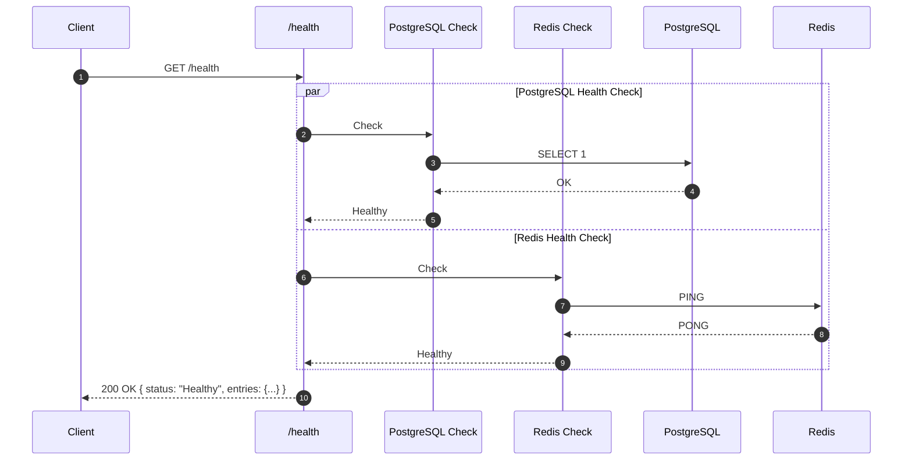

# Basket Service - Diagrammes de Sequence

## Vue d'Ensemble

Ce document presente les diagrammes de sequence pour les operations du service Basket, mettant en evidence le pattern Decorator pour le cache Redis et l'integration gRPC avec le service Discount.

## Operations de Lecture

### GET /baskets/{userName} - Avec Cache Hit

### GET /baskets/{userName} - Avec Cache Miss

## Operations d'Ecriture

### POST /baskets/{userName} - Creation/Mise a jour

### DELETE /baskets/{userName} - Suppression

## Integration avec Discount Service (gRPC)

### POST /baskets/{userName}/items - Ajout d'article avec remise

### PUT /baskets/{userName}/items - Modification de quantite

### DELETE /baskets/{userName}/items/{productId} - Suppression d'article

## Pattern Decorator en Detail

## Flux Evenementiel (Planifie)

### Reception OrderCreated Event

## Health Check

### GET /health

