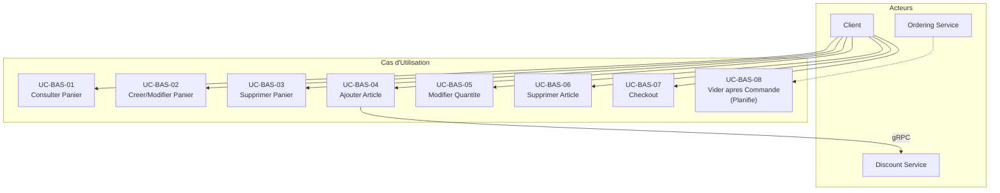

# Basket Service - Cas d'Utilisation

## Vue d'Ensemble

Le service Basket gere les paniers d'achat des utilisateurs. Il permet de creer, consulter, modifier et supprimer des paniers, avec un systeme de cache Redis pour optimiser les performances. Il communique avec le service Discount via gRPC pour appliquer automatiquement les remises sur les articles.

## Acteurs

| Acteur  | Description                            |
| ------- | -------------------------------------- |
| Client  | Utilisateur avec un panier d'achat     |
| Systeme | Services internes (Ordering, Discount) |

## Cas d'Utilisation

### UC-BAS-01 : Consulter le Panier

**Acteur** : Client

**Description** : Permet de recuperer le contenu du panier d'un utilisateur.

**Preconditions** : Aucune (retourne un panier vide si inexistant)

**Flux Principal** :

1. Le client envoie une requete GET /baskets/{userName}
2. Le systeme verifie le cache Redis
3. Si cache hit, retourne le panier du cache
4. Si cache miss, interroge la base de donnees
5. Met a jour le cache
6. Retourne le panier

**Reponse** :

```json
{
  "userName": "john_doe",
  "items": [
    {
      "productId": "guid",
      "productName": "Product Name",
      "price": 99.99,
      "quantity": 2,
      "color": "Red"
    }
  ],
  "total": 199.98
}
```

---

### UC-BAS-02 : Creer/Mettre a jour le Panier

**Acteur** : Client

**Description** : Permet de creer un nouveau panier ou mettre a jour un panier existant.

**Preconditions** : Aucune

**Flux Principal** :

1. Le client envoie une requete POST /baskets/{userName} avec les items
2. Le systeme valide les donnees
3. Le systeme persiste le panier dans la base de donnees
4. Le systeme met a jour le cache Redis
5. Le systeme retourne le panier cree/modifie

**Donnees Requises** :

```json
{
  "userName": "string (requis)",
  "items": [
    {
      "productId": "guid (requis)",
      "productName": "string (requis)",
      "price": "decimal (requis)",
      "quantity": "int (requis, > 0)",
      "color": "string"
    }
  ]
}
```

**Flux Alternatif** :

- 2a. Validation echouee : retourne 400 Bad Request

---

### UC-BAS-03 : Supprimer le Panier

**Acteur** : Client, Systeme

**Description** : Permet de supprimer completement le panier d'un utilisateur.

**Preconditions** : Le panier doit exister

**Flux Principal** :

1. L'acteur envoie une requete DELETE /baskets/{userName}
2. Le systeme supprime le panier de la base de donnees
3. Le systeme invalide le cache Redis
4. Le systeme retourne confirmation

**Flux Alternatif** :

- 2a. Panier non trouve : retourne 404 Not Found

---

### UC-BAS-04 : Ajouter un Article au Panier

**Acteur** : Client

**Description** : Permet d'ajouter un article au panier. Le service interroge automatiquement le service Discount via gRPC pour appliquer la remise applicable.

**Preconditions** :

- Le panier doit exister
- Le service Discount doit etre disponible (gRPC)

**Flux Principal** :

1. Le client envoie une requete POST /baskets/{userName}/items avec les details de l'article
2. Le systeme valide les donnees
3. Le systeme appelle le service Discount via gRPC (`GetDiscount`) pour recuperer la remise applicable
4. Le systeme applique la remise sur le prix de l'article (`price -= discount.Amount`)
5. Le systeme ajoute l'article au panier
6. Le systeme persiste le panier et met a jour le cache Redis
7. Le systeme retourne le panier mis a jour

**Flux Alternatif** :

- 2a. Validation echouee : retourne 400 Bad Request
- 3a. Aucune remise trouvee (NOT_FOUND gRPC) : l'article est ajoute sans remise

---

### UC-BAS-05 : Modifier la Quantite d'un Article

**Acteur** : Client

**Description** : Permet de modifier la quantite d'un article existant dans le panier.

**Preconditions** : Le panier et l'article doivent exister

**Flux Principal** :

1. Le client envoie une requete PUT /baskets/{userName}/items avec le productId et la nouvelle quantite
2. Le systeme valide les donnees
3. Le systeme met a jour la quantite de l'article
4. Le systeme persiste le panier et met a jour le cache Redis
5. Le systeme retourne le panier mis a jour

**Flux Alternatif** :

- 2a. Validation echouee : retourne 400 Bad Request
- 3a. Article non trouve : retourne 404 Not Found

---

### UC-BAS-06 : Supprimer un Article du Panier

**Acteur** : Client

**Description** : Permet de supprimer un article specifique du panier.

**Preconditions** : Le panier et l'article doivent exister

**Flux Principal** :

1. Le client envoie une requete DELETE /baskets/{userName}/items/{productId}
2. Le systeme recherche l'article dans le panier
3. Le systeme supprime l'article
4. Le systeme persiste le panier et met a jour le cache Redis
5. Le systeme retourne le panier mis a jour

**Flux Alternatif** :

- 2a. Article non trouve : retourne 404 Not Found

---

### UC-BAS-07 : Valider le Panier (Checkout)

**Acteur** : Client

**Description** : Valide le panier pour passer a la commande.

**Preconditions** : Le panier doit exister et contenir au moins un article

**Flux Principal** :

1. Le client envoie une requete POST /baskets/{userName}/checkout
2. Le systeme recupere le panier
3. Le systeme valide le contenu du panier
4. Le systeme retourne la confirmation

---

### UC-BAS-08 : Vider le Panier apres Commande (Planifie)

**Acteur** : Systeme (Ordering Service)

**Description** : Vide automatiquement le panier apres la creation d'une commande.

**Preconditions** : Evenement OrderCreated recu

**Flux Principal** :

1. Le systeme recoit l'evenement OrderCreated via RabbitMQ
2. Le systeme identifie l'utilisateur
3. Le systeme supprime le panier
4. Le systeme invalide le cache

---

## Diagramme des Cas d'Utilisation



## Modele de Donnees

### ShoppingCart

```json
{
  "userName": "string (identity)",
  "items": "ShoppingCartItem[]",
  "total": "decimal (computed)"
}
```

### ShoppingCartItem

```json
{
  "quantity": "int",
  "color": "string",
  "productName": "string",
  "price": "decimal",
  "productId": "guid"
}
```

## API Endpoints

| Methode | Endpoint                               | Description                    |
| ------- | -------------------------------------- | ------------------------------ |
| GET     | /baskets/{userName}                    | Recuperer le panier            |
| POST    | /baskets/{userName}                    | Creer/modifier le panier       |
| DELETE  | /baskets/{userName}                    | Supprimer le panier            |
| POST    | /baskets/{userName}/items              | Ajouter un article au panier   |
| PUT     | /baskets/{userName}/items              | Modifier la quantite d'un article |
| DELETE  | /baskets/{userName}/items/{productId}  | Supprimer un article du panier |
| POST    | /baskets/{userName}/checkout           | Valider le panier (checkout)   |
| GET     | /health                                | Health check                   |

## Communication Inter-Services

| Service | Protocole | Usage |
| --- | --- | --- |
| Discount.Grpc | gRPC (HTTP/2 + Protobuf) | Recuperation des remises lors de l'ajout d'articles |
| Ordering (Planifie) | RabbitMQ (Event-Driven) | Reception de l'evenement OrderCreated pour vider le panier |
