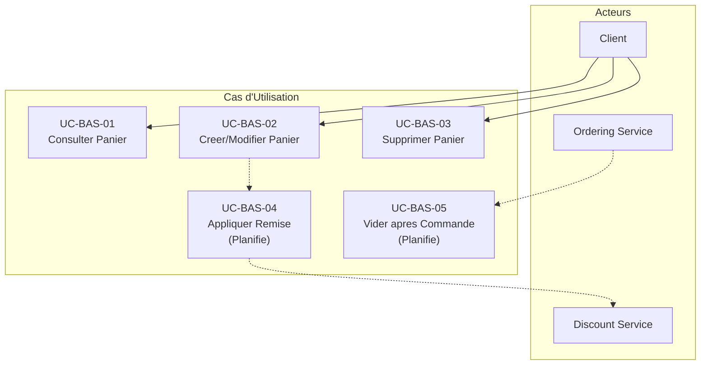

# Basket Service - Cas d'Utilisation

## Vue d'Ensemble

Le service Basket gere les paniers d'achat des utilisateurs. Il permet de creer, consulter et supprimer des paniers, avec un systeme de cache Redis pour optimiser les performances.

## Acteurs

| Acteur  | Description                            |
| ------- | -------------------------------------- |
| Client  | Utilisateur avec un panier d'achat     |
| Systeme | Services internes (Ordering, Discount) |

## Cas d'Utilisation

### UC-BAS-01 : Consulter le Panier

**Acteur** : Client

**Description** : Permet de recuperer le contenu du panier d'un utilisateur.

**Preconditions** : Aucune (retourne un panier vide si inexistant)

**Flux Principal** :

1. Le client envoie une requete GET /baskets/{userName}
2. Le systeme verifie le cache Redis
3. Si cache hit, retourne le panier du cache
4. Si cache miss, interroge la base de donnees
5. Met a jour le cache
6. Retourne le panier

**Reponse** :

```json
{
  "userName": "john_doe",
  "items": [
    {
      "productId": "guid",
      "productName": "Product Name",
      "price": 99.99,
      "quantity": 2,
      "color": "Red"
    }
  ],
  "total": 199.98
}
```

---

### UC-BAS-02 : Creer/Mettre a jour le Panier

**Acteur** : Client

**Description** : Permet de creer un nouveau panier ou mettre a jour un panier existant.

**Preconditions** : Aucune

**Flux Principal** :

1. Le client envoie une requete POST /baskets/{userName} avec les items
2. Le systeme valide les donnees
3. Le systeme persiste le panier dans la base de donnees
4. Le systeme met a jour le cache Redis
5. Le systeme retourne le panier cree/modifie

**Donnees Requises** :

```json
{
  "userName": "string (requis)",
  "items": [
    {
      "productId": "guid (requis)",
      "productName": "string (requis)",
      "price": "decimal (requis)",
      "quantity": "int (requis, > 0)",
      "color": "string"
    }
  ]
}
```

**Flux Alternatif** :

- 2a. Validation echouee : retourne 400 Bad Request

---

### UC-BAS-03 : Supprimer le Panier

**Acteur** : Client, Systeme

**Description** : Permet de supprimer completement le panier d'un utilisateur.

**Preconditions** : Le panier doit exister

**Flux Principal** :

1. L'acteur envoie une requete DELETE /baskets/{userName}
2. Le systeme supprime le panier de la base de donnees
3. Le systeme invalide le cache Redis
4. Le systeme retourne confirmation

**Flux Alternatif** :

- 2a. Panier non trouve : retourne 404 Not Found

---

### UC-BAS-04 : Appliquer une Remise (Planifie)

**Acteur** : Systeme

**Description** : Permet d'appliquer une remise sur un article du panier via le service Discount.

**Preconditions** :

- Le panier doit exister
- Le service Discount doit etre disponible

**Flux Principal** :

1. Le systeme recupere le panier
2. Pour chaque item, appel gRPC au service Discount
3. Le service Discount retourne le montant de remise
4. Le systeme applique la remise sur l'item
5. Le systeme recalcule le total
6. Le systeme retourne le panier avec remises

---

### UC-BAS-05 : Vider le Panier apres Commande (Planifie)

**Acteur** : Systeme (Ordering Service)

**Description** : Vide automatiquement le panier apres la creation d'une commande.

**Preconditions** : Evenement OrderCreated recu

**Flux Principal** :

1. Le systeme recoit l'evenement OrderCreated via RabbitMQ
2. Le systeme identifie l'utilisateur
3. Le systeme supprime le panier
4. Le systeme invalide le cache

---

## Diagramme des Cas d'Utilisation



## Modele de Donnees

### ShoppingCart

```json
{
  "userName": "string (identity)",
  "items": "ShoppingCartItem[]",
  "total": "decimal (computed)"
}
```

### ShoppingCartItem

```json
{
  "quantity": "int",
  "color": "string",
  "productName": "string",
  "price": "decimal",
  "productId": "guid"
}
```

## API Endpoints

| Methode | Endpoint            | Description              |
| ------- | ------------------- | ------------------------ |
| GET     | /baskets/{userName} | Recuperer le panier      |
| POST    | /baskets/{userName} | Creer/modifier le panier |
| DELETE  | /baskets/{userName} | Supprimer le panier      |
| GET     | /health             | Health check             |
