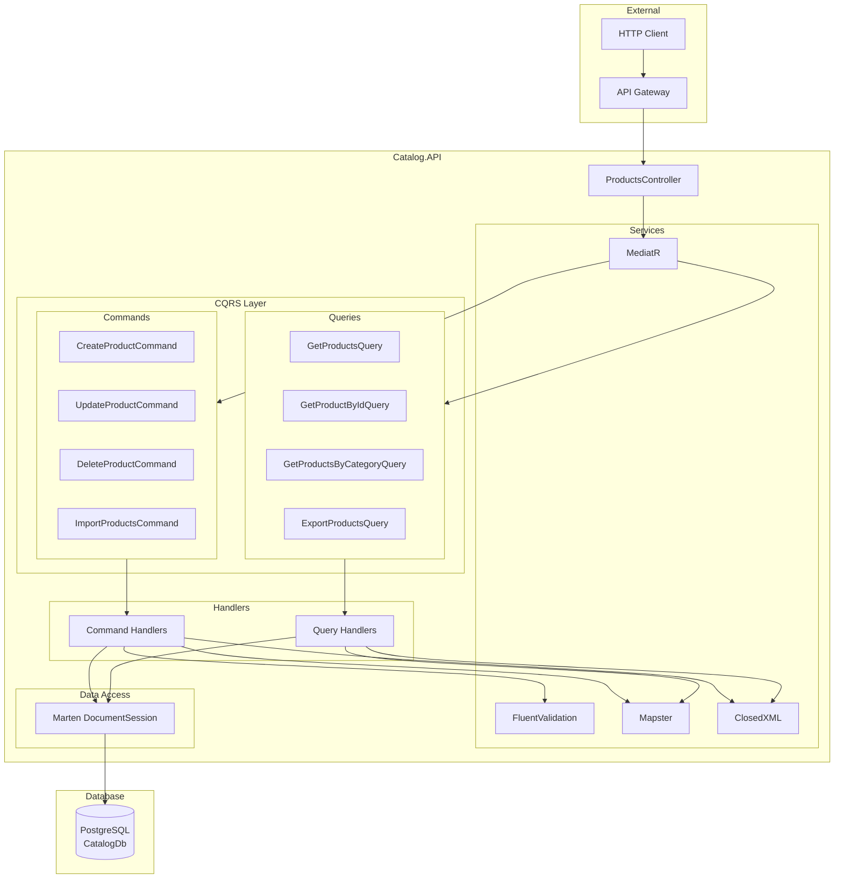
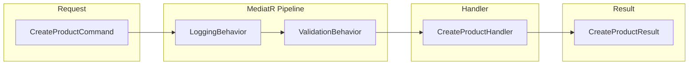
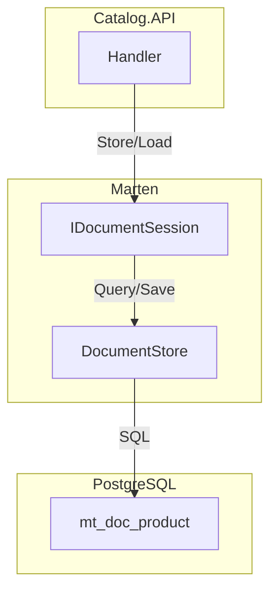
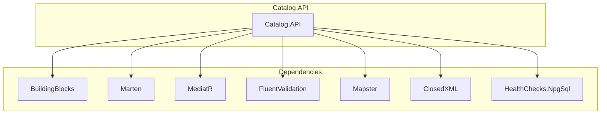

# Catalog Service - Architecture des Composants

## Vue d'Ensemble

Le Catalog Service est responsable de la gestion du catalogue de produits. Il est construit sur une architecture CQRS avec MediatR et utilise Marten comme document store sur PostgreSQL.

## Architecture Globale



## Structure des Dossiers

```
Catalog.API/
├── Controllers/
│   └── ProductsController.cs
├── Features/
│   └── Products/
│       ├── Commands/
│       │   ├── CreateProduct/
│       │   │   ├── CreateProductCommand.cs
│       │   │   ├── CreateProductHandler.cs
│       │   │   └── CreateProductValidator.cs
│       │   ├── UpdateProduct/
│       │   ├── DeleteProduct/
│       │   └── ImportProducts/
│       └── Queries/
│           ├── GetProducts/
│           ├── GetProductById/
│           ├── GetProductsByCategory/
│           └── ExportProducts/
├── Models/
│   └── Product.cs
├── Data/
│   └── CatalogInitialData.cs
├── Extensions/
│   └── ServiceCollectionExtensions.cs
├── Program.cs
├── Dockerfile
└── appsettings.json
```

## Composants Principaux

### ProductsController

Point d'entree HTTP pour toutes les operations sur les produits.

```csharp
[ApiController]
[Route("[controller]")]
public class ProductsController : ControllerBase
{
    private readonly ISender _sender;

    // GET /products
    // GET /products/{id}
    // GET /products/category/{category}
    // POST /products
    // PUT /products/{id}
    // DELETE /products/{id}
    // POST /products/import
    // GET /products/export
}
```

### Modele Product

```csharp
public class Product
{
    public Guid Id { get; set; }
    public string Name { get; set; } = string.Empty;
    public string Description { get; set; } = string.Empty;
    public decimal Price { get; set; }
    public string ImageFile { get; set; } = string.Empty;
    public List<string> Categories { get; set; } = [];
}
```

## Commands et Handlers

### CreateProductCommand



| Propriete   | Type         | Requis | Validation |
| ----------- | ------------ | ------ | ---------- |
| Name        | string       | Oui    | Non vide   |
| Description | string       | Non    | -          |
| Price       | decimal      | Oui    | > 0        |
| ImageFile   | string       | Non    | -          |
| Categories  | List<string> | Non    | -          |

### UpdateProductCommand

| Propriete   | Type         | Requis | Validation       |
| ----------- | ------------ | ------ | ---------------- |
| Id          | Guid         | Oui    | Produit existant |
| Name        | string       | Oui    | Non vide         |
| Description | string       | Non    | -                |
| Price       | decimal      | Oui    | > 0              |
| ImageFile   | string       | Non    | -                |
| Categories  | List<string> | Non    | -                |

### DeleteProductCommand

| Propriete | Type | Requis | Validation       |
| --------- | ---- | ------ | ---------------- |
| Id        | Guid | Oui    | Produit existant |

### ImportProductsCommand

| Propriete | Type      | Requis | Validation   |
| --------- | --------- | ------ | ------------ |
| File      | IFormFile | Oui    | .xlsx valide |

## Queries et Handlers

### GetProductsQuery

| Propriete  | Type | Defaut |
| ---------- | ---- | ------ |
| PageNumber | int  | 1      |
| PageSize   | int  | 10     |

**Resultat** : `PaginatedResult<ProductDto>`

### GetProductByIdQuery

| Propriete | Type | Requis |
| --------- | ---- | ------ |
| Id        | Guid | Oui    |

**Resultat** : `ProductDto` ou `NotFoundException`

### GetProductsByCategoryQuery

| Propriete | Type   | Requis |
| --------- | ------ | ------ |
| Category  | string | Oui    |

**Resultat** : `IEnumerable<ProductDto>`

### ExportProductsQuery

Aucun parametre requis.

**Resultat** : `byte[]` (fichier Excel)

## Integration avec Marten



### Operations Marten

| Operation | Methode                          | Description         |
| --------- | -------------------------------- | ------------------- |
| Create    | `session.Store(product)`         | Insere un document  |
| Read      | `session.LoadAsync<Product>(id)` | Charge par ID       |
| Query     | `session.Query<Product>()`       | Requete LINQ        |
| Update    | `session.Store(product)`         | Met a jour (upsert) |
| Delete    | `session.Delete<Product>(id)`    | Supprime            |
| Save      | `session.SaveChangesAsync()`     | Commit transaction  |

## Dependances



## Configuration

### appsettings.json

```json
{
  "ConnectionStrings": {
    "CatalogConnection": "Server=...;Database=CatalogDb;..."
  },
  "Logging": {
    "LogLevel": {
      "Default": "Information"
    }
  }
}
```

### Program.cs (Services)

```csharp
// Marten
builder.Services.AddMarten(options =>
{
    options.Connection(connectionString);
}).UseLightweightSessions();

// MediatR + Behaviors
builder.Services.AddMediatR(cfg =>
    cfg.RegisterServicesFromAssembly(typeof(Program).Assembly));

// FluentValidation
builder.Services.AddValidatorsFromAssembly(typeof(Program).Assembly);

// Health Checks
builder.Services.AddHealthChecks()
    .AddNpgSql(connectionString);
```
