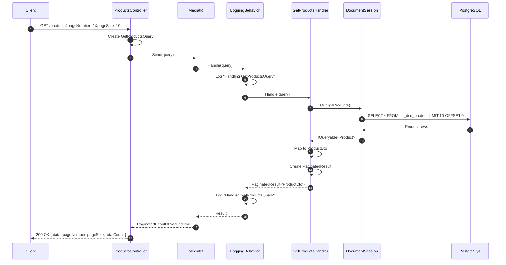
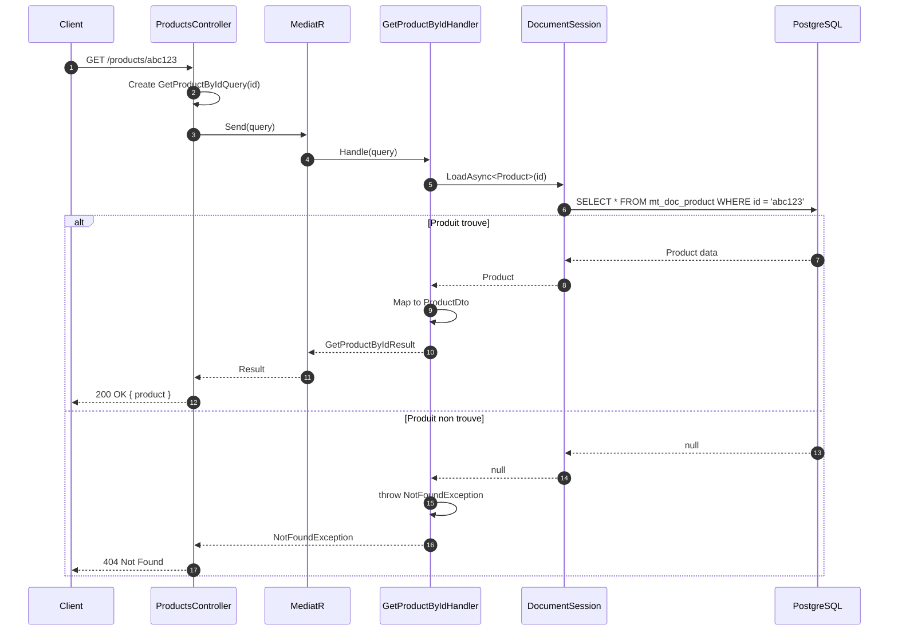
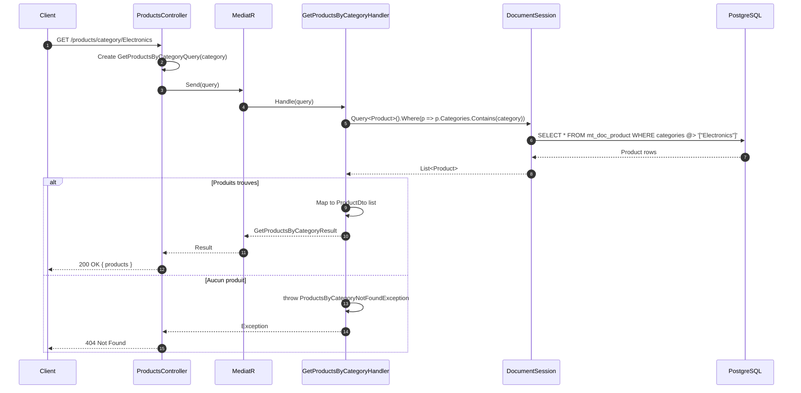
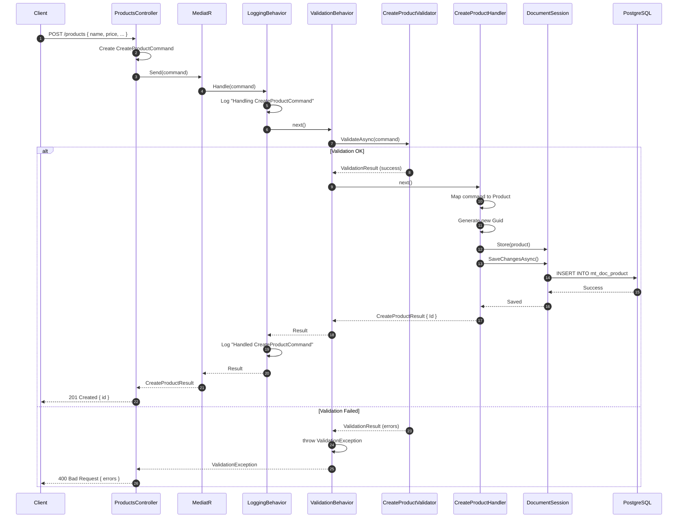
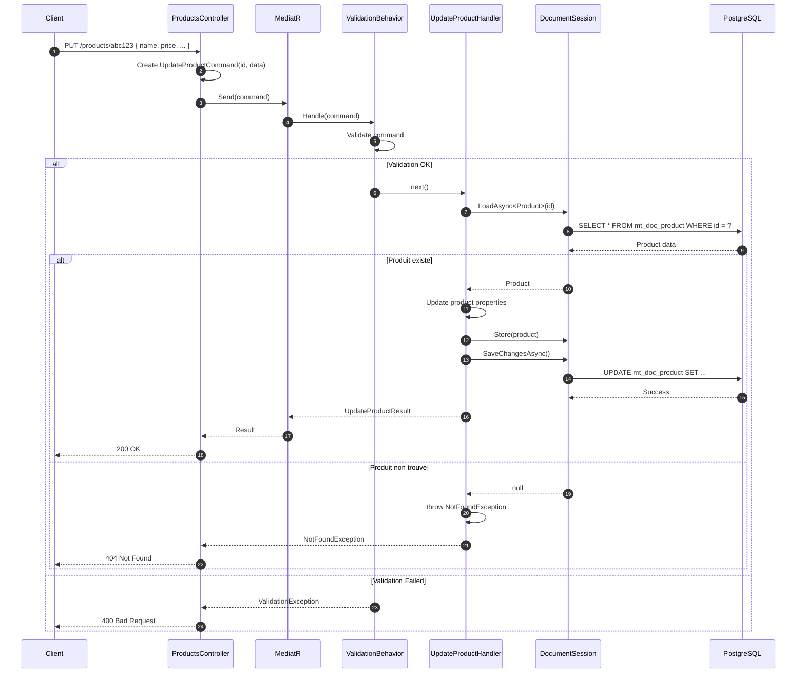
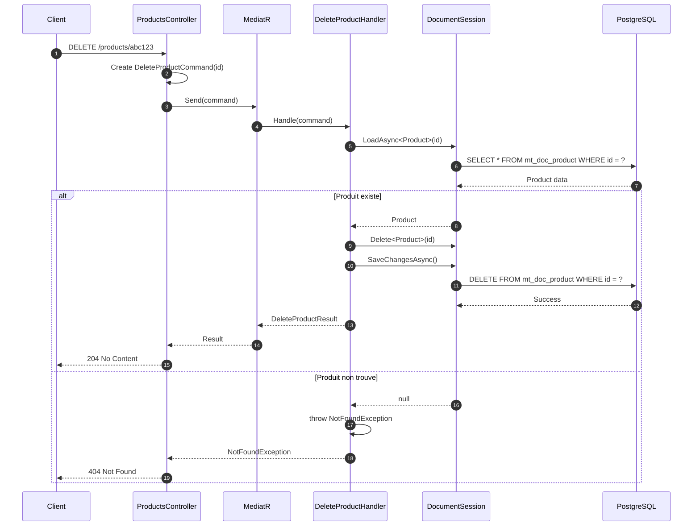
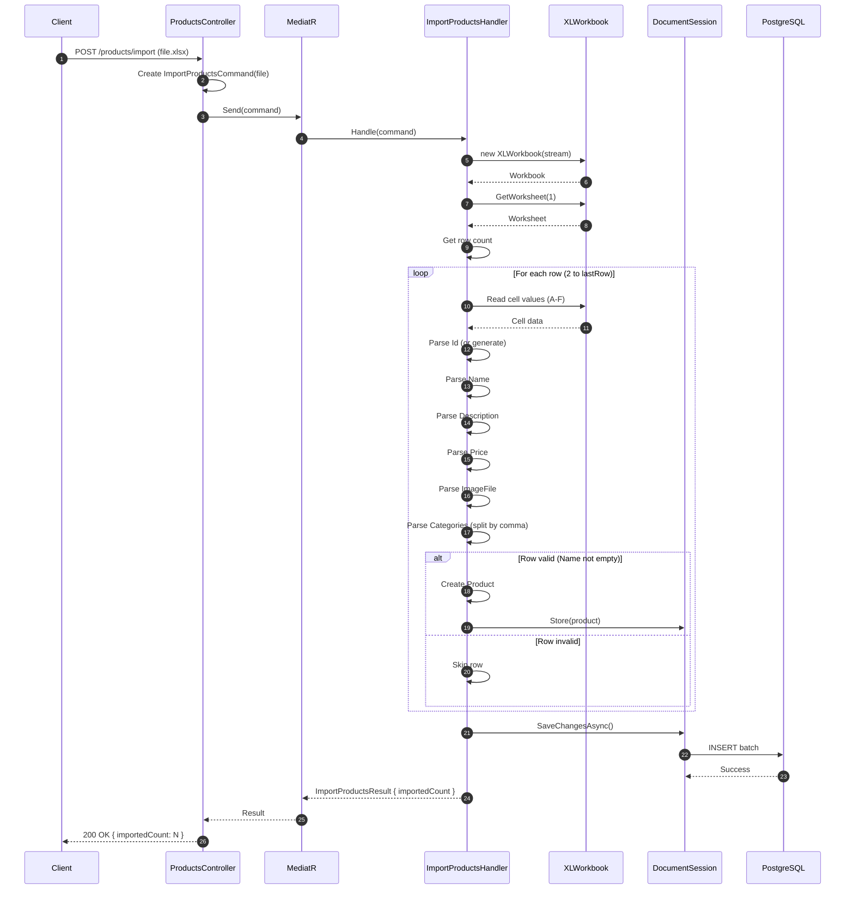
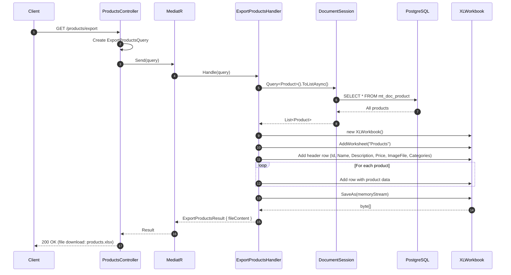
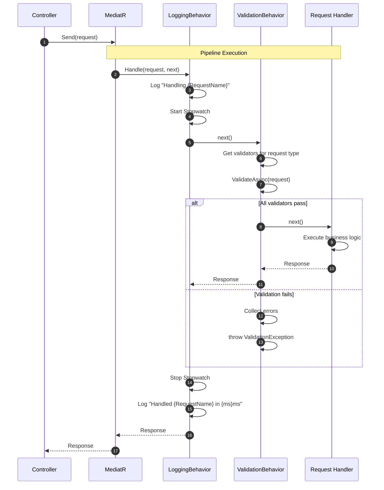

# Catalog Service - Diagrammes de Sequence

## Vue d'Ensemble

Ce document presente les diagrammes de sequence pour les principales operations du service Catalog.

## Operations de Lecture

### GET /products - Liste Paginee

### GET /products/{id} - Produit par ID

### GET /products/category/{category} - Par Categorie

## Operations d'Ecriture

### POST /products - Creation

### PUT /products/{id} - Modification

### DELETE /products/{id} - Suppression

## Operations Import/Export

### POST /products/import - Import Excel

### GET /products/export - Export Excel

## Pipeline MediatR

