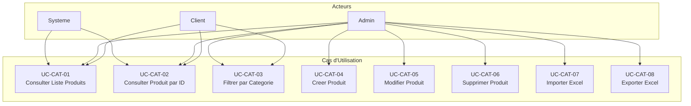

# Catalog Service - Cas d'Utilisation

## Vue d'Ensemble

Le service Catalog gere le catalogue de produits de la plateforme e-commerce. Il permet de creer, modifier, supprimer et consulter les produits, ainsi que d'importer/exporter des donnees via Excel.

## Acteurs

| Acteur  | Description                          |
| ------- | ------------------------------------ |
| Client  | Utilisateur consultant le catalogue  |
| Admin   | Administrateur gerant les produits   |
| Systeme | Services internes (Basket, Ordering) |

## Cas d'Utilisation

### UC-CAT-01 : Consulter la Liste des Produits

**Acteur** : Client, Systeme

**Description** : Permet de recuperer la liste paginee des produits du catalogue.

**Preconditions** : Aucune

**Flux Principal** :

1. L'acteur envoie une requete GET /products
2. Le systeme recupere les produits avec pagination
3. Le systeme retourne la liste paginee

**Parametres** :

- `pageNumber` (optionnel) : Numero de page (defaut: 1)
- `pageSize` (optionnel) : Taille de page (defaut: 10)

**Reponse** :

```json
{
  "data": [...],
  "pageNumber": 1,
  "pageSize": 10,
  "totalCount": 100,
  "totalPages": 10
}
```

---

### UC-CAT-02 : Consulter un Produit par ID

**Acteur** : Client, Systeme

**Description** : Permet de recuperer les details d'un produit specifique.

**Preconditions** : Le produit doit exister

**Flux Principal** :

1. L'acteur envoie une requete GET /products/{id}
2. Le systeme recherche le produit
3. Le systeme retourne les details du produit

**Flux Alternatif** :

- 2a. Produit non trouve : retourne 404 Not Found

---

### UC-CAT-03 : Consulter les Produits par Categorie

**Acteur** : Client

**Description** : Permet de filtrer les produits par categorie.

**Preconditions** : Aucune

**Flux Principal** :

1. L'acteur envoie une requete GET /products/category/{category}
2. Le systeme filtre les produits par categorie
3. Le systeme retourne la liste filtree

**Flux Alternatif** :

- 2a. Aucun produit dans la categorie : retourne liste vide

---

### UC-CAT-04 : Creer un Produit

**Acteur** : Admin

**Description** : Permet de creer un nouveau produit dans le catalogue.

**Preconditions** : Authentification admin requise

**Flux Principal** :

1. L'admin envoie une requete POST /products avec les donnees
2. Le systeme valide les donnees
3. Le systeme cree le produit
4. Le systeme retourne l'ID du produit cree

**Donnees Requises** :

```json
{
  "name": "string (requis)",
  "description": "string",
  "price": "decimal (requis, > 0)",
  "imageFile": "string",
  "categories": ["string"]
}
```

**Flux Alternatif** :

- 2a. Validation echouee : retourne 400 Bad Request

---

### UC-CAT-05 : Modifier un Produit

**Acteur** : Admin

**Description** : Permet de modifier un produit existant.

**Preconditions** :

- Authentification admin requise
- Le produit doit exister

**Flux Principal** :

1. L'admin envoie une requete PUT /products/{id} avec les nouvelles donnees
2. Le systeme valide les donnees
3. Le systeme met a jour le produit
4. Le systeme retourne confirmation

**Flux Alternatif** :

- 2a. Validation echouee : retourne 400 Bad Request
- 2b. Produit non trouve : retourne 404 Not Found

---

### UC-CAT-06 : Supprimer un Produit

**Acteur** : Admin

**Description** : Permet de supprimer un produit du catalogue.

**Preconditions** :

- Authentification admin requise
- Le produit doit exister

**Flux Principal** :

1. L'admin envoie une requete DELETE /products/{id}
2. Le systeme verifie l'existence du produit
3. Le systeme supprime le produit
4. Le systeme retourne confirmation

**Flux Alternatif** :

- 2a. Produit non trouve : retourne 404 Not Found

---

### UC-CAT-07 : Importer des Produits depuis Excel

**Acteur** : Admin

**Description** : Permet d'importer en masse des produits depuis un fichier Excel.

**Preconditions** :

- Authentification admin requise
- Fichier Excel valide (.xlsx)

**Flux Principal** :

1. L'admin envoie une requete POST /products/import avec le fichier
2. Le systeme ouvre et parse le fichier Excel
3. Pour chaque ligne, le systeme valide et cree le produit
4. Le systeme retourne le nombre de produits importes

**Format Excel Attendu** :
| Colonne | Type | Description |
|---------|------|-------------|
| A | GUID (optionnel) | ID du produit |
| B | String | Nom du produit |
| C | String | Description |
| D | Decimal | Prix |
| E | String | URL image |
| F | String | Categories (separees par virgule) |

**Flux Alternatif** :

- 2a. Fichier invalide : retourne 400 Bad Request
- 3a. Ligne invalide : ignoree, continue le traitement

---

### UC-CAT-08 : Exporter les Produits vers Excel

**Acteur** : Admin

**Description** : Permet d'exporter tous les produits vers un fichier Excel.

**Preconditions** : Authentification admin requise

**Flux Principal** :

1. L'admin envoie une requete GET /products/export
2. Le systeme recupere tous les produits
3. Le systeme genere le fichier Excel
4. Le systeme retourne le fichier en telechargement

---

## Diagramme des Cas d'Utilisation


