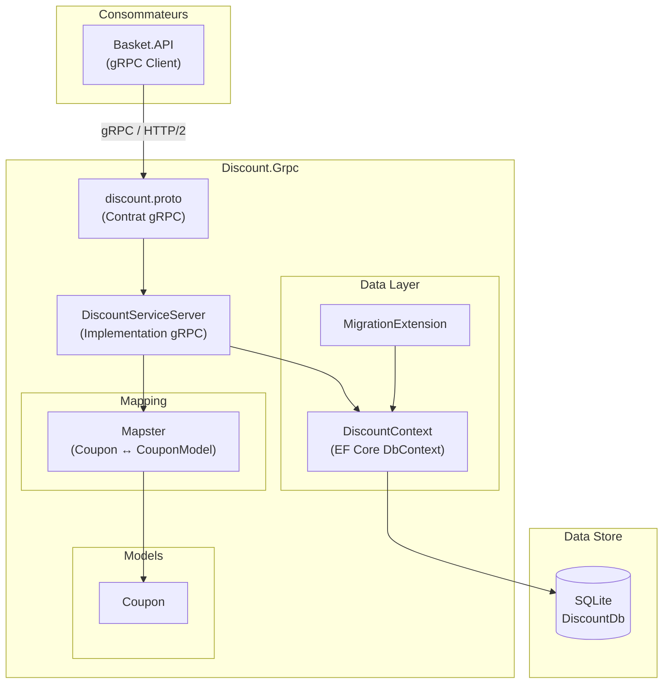
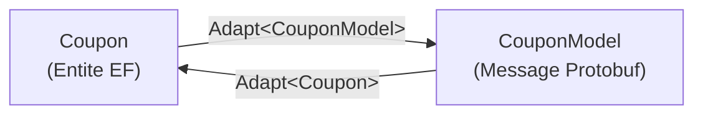
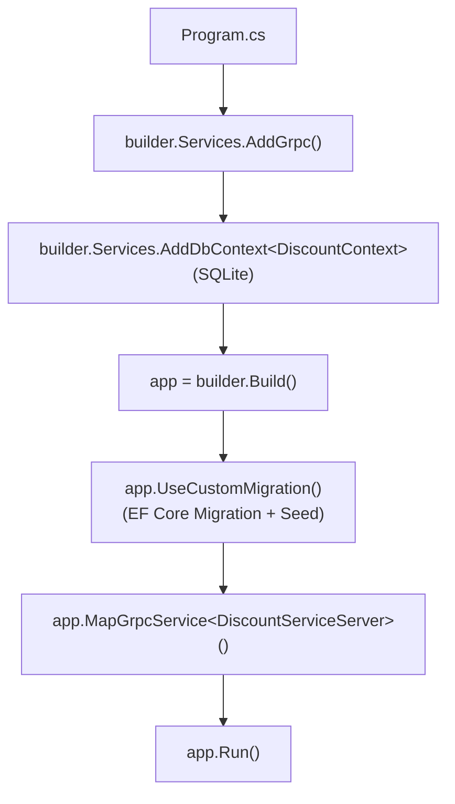
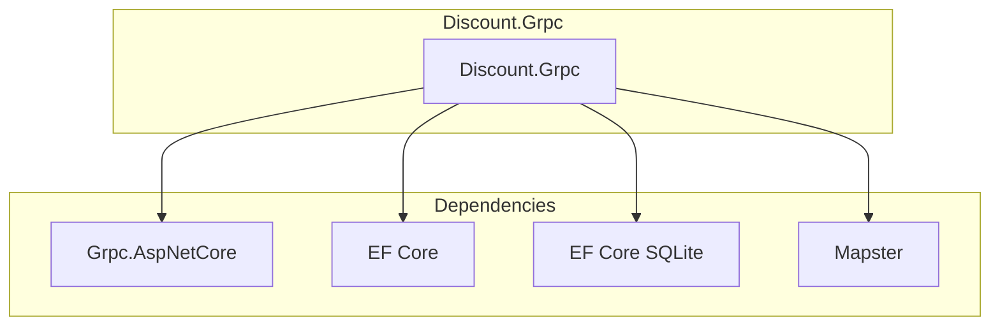

# Discount Service - Architecture des Composants

## Vue d'Ensemble

Le Discount Service gere les coupons de reduction. Il expose un serveur gRPC (HTTP/2 + Protobuf) pour les operations CRUD sur les coupons, avec une base de donnees SQLite et Entity Framework Core comme ORM. C'est un service interne consomme par le service Basket.

## Architecture Globale



## Structure des Dossiers

```
Discount.Grpc/
├── Protos/
│   └── discount.proto              # Contrat gRPC (service + messages)
├── Services/
│   └── DiscountServiceServer.cs    # Implementation du serveur gRPC
├── Models/
│   └── Coupon.cs                   # Entite de domaine
├── Data/
│   ├── DiscountContext.cs          # DbContext EF Core + Seed data
│   └── Extensions/
│       └── MigrationExtension.cs   # Migration automatique au demarrage
├── Migrations/
│   └── ...                         # Migrations EF Core
├── Program.cs                      # Configuration et demarrage
├── Discount.Grpc.csproj            # Configuration du projet
└── appsettings.json                # Configuration
```

## Composants Principaux

### Contrat gRPC (discount.proto)

Le fichier `.proto` definit le contrat strict entre le serveur et les clients. Il est partage avec le projet Basket.API.

```protobuf
syntax = "proto3";

option csharp_namespace = "Discount.Grpc";

package discount;

service DiscountProtoService {
  rpc GetDiscount (GetDiscountRequest) returns (CouponModel);
  rpc CreateDiscount (CreateDiscountRequest) returns (CouponModel);
  rpc UpdateDiscount (UpdateDiscountRequest) returns (CouponModel);
  rpc DeleteDiscount (DeleteDiscountRequest) returns (DeleteDiscountResponse);
}

message CouponModel {
  int32 id = 1;
  string productName = 2;
  string description = 3;
  double amount = 4;
}
```

### DiscountServiceServer

Implementation du serveur gRPC. Herite de `DiscountProtoService.DiscountProtoServiceBase` (genere a partir du `.proto`).

```csharp
public class DiscountServiceServer(DiscountContext dbContext, ILogger<DiscountServiceServer> logger)
    : DiscountProtoService.DiscountProtoServiceBase
{
    // GetDiscount   → Recherche par ProductName, retourne CouponModel
    // CreateDiscount → Ajoute un coupon, retourne CouponModel
    // UpdateDiscount → Met a jour par ProductName ou Id, retourne CouponModel
    // DeleteDiscount → Supprime par ProductName ou Id, retourne DeleteDiscountResponse
}
```

**Gestion des erreurs gRPC :**

| StatusCode | Condition |
| --- | --- |
| `NOT_FOUND` | Coupon non trouve pour le produit ou l'ID donne |
| `INVALID_ARGUMENT` | Requete avec coupon null |

### Modele Coupon

```csharp
public class Coupon
{
    public int Id { get; set; }
    public string ProductName { get; set; } = string.Empty;
    public string Description { get; set; } = string.Empty;
    public double Amount { get; set; }
}
```

### DiscountContext (EF Core)

```csharp
public sealed class DiscountContext(DbContextOptions<DiscountContext> options) : DbContext(options)
{
    public DbSet<Coupon> Coupons { get; set; }

    // Seed data: IPhone X (150.0), Samsung 10 (100.0)
}
```

## Mapping (Mapster)

Le mapping entre l'entite `Coupon` et le message Protobuf `CouponModel` est gere par Mapster.



## Pipeline de Demarrage



## Dependances



## Configuration

### appsettings.json

```json
{
  "ConnectionStrings": {
    "DiscountConnection": "Data Source=discount.db"
  }
}
```

### Program.cs (Services)

```csharp
// gRPC
builder.Services.AddGrpc();

// Entity Framework + SQLite
builder.Services.AddDbContext<DiscountContext>(options =>
    options.UseSqlite(configuration.GetConnectionString("DiscountConnection")));

// Migration automatique au demarrage
app.UseCustomMigration();

// Mapping du service gRPC
app.MapGrpcService<DiscountServiceServer>();
```
