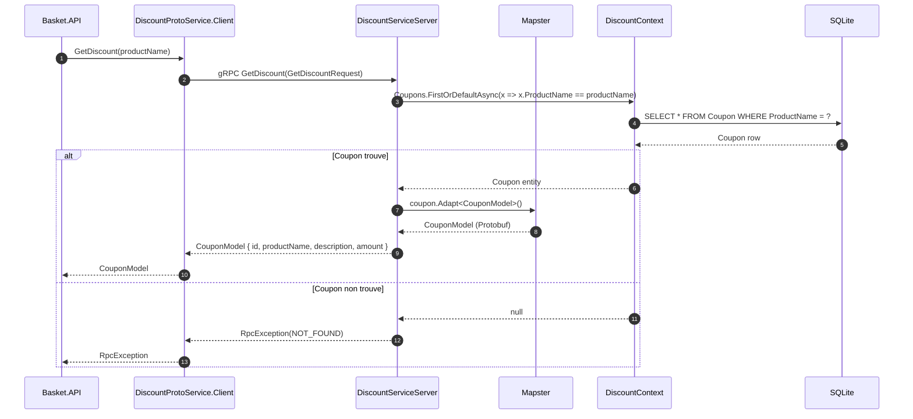
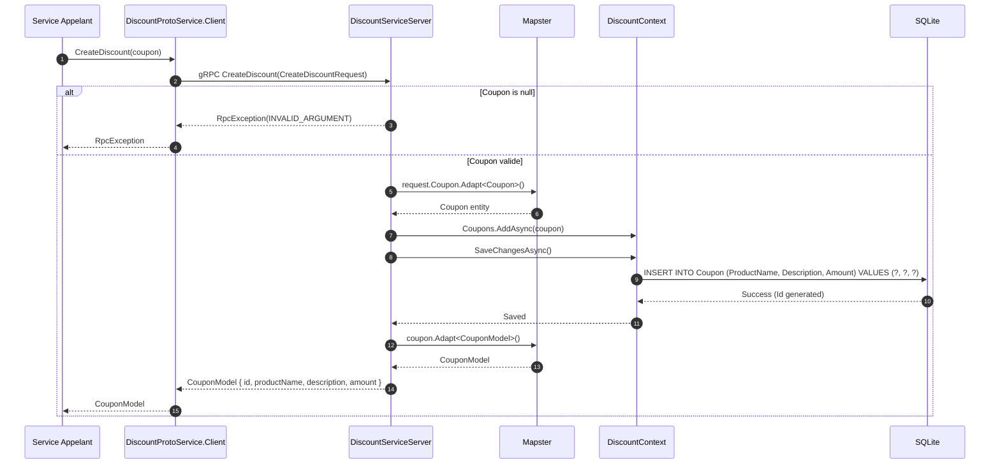
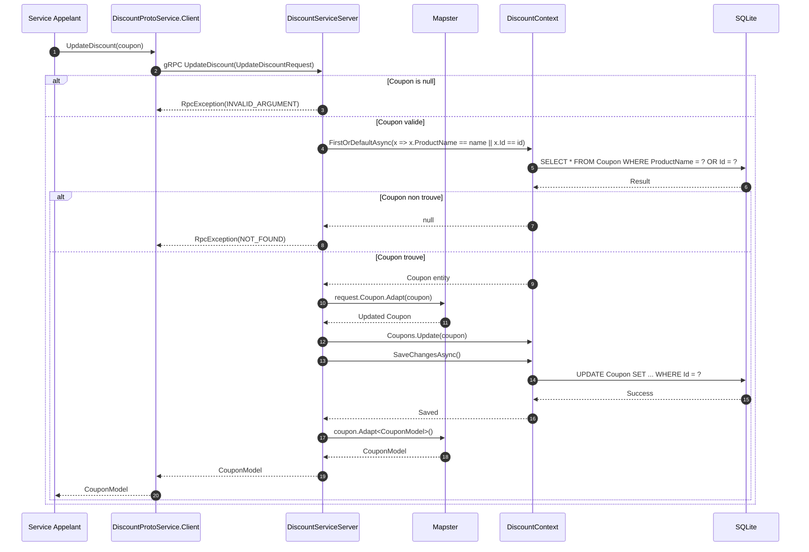
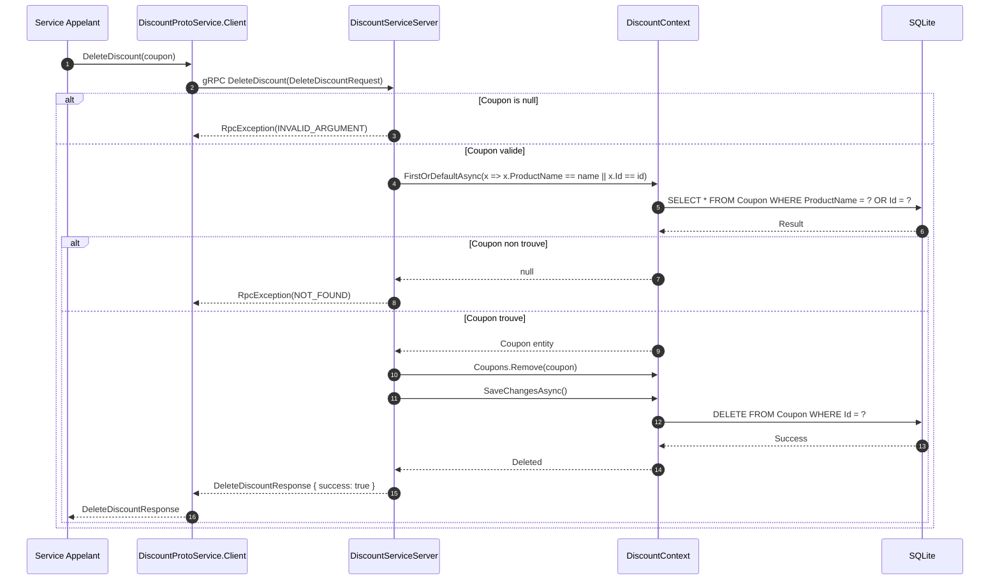
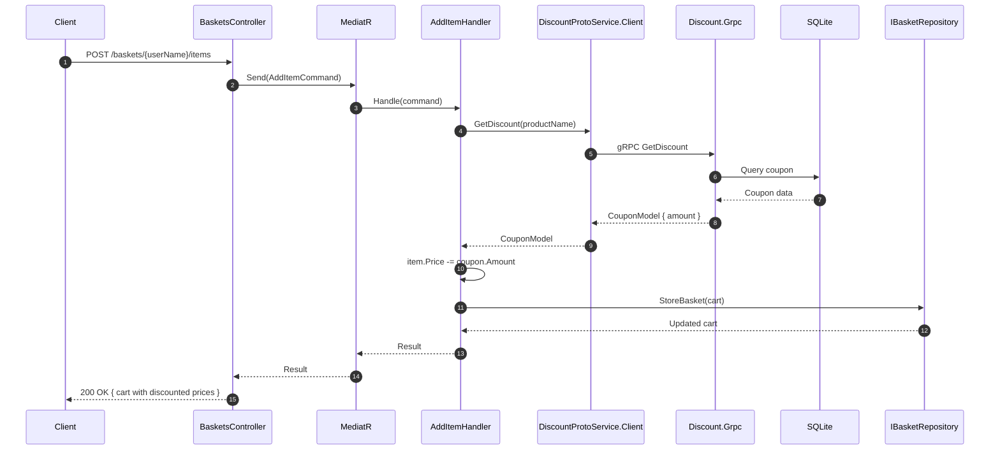
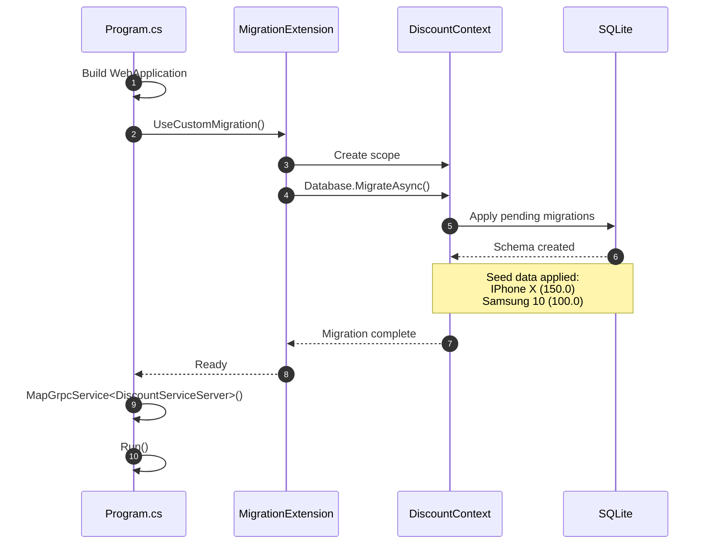

# Discount Service - Diagrammes de Sequence

## Vue d'Ensemble

Ce document presente les diagrammes de sequence pour les operations du service Discount, illustrant le flux gRPC depuis le client (Basket.API) jusqu'a la base de donnees SQLite.

## Operations de Lecture

### GetDiscount - Recuperation d'une remise

## Operations d'Ecriture

### CreateDiscount - Creation d'un coupon

### UpdateDiscount - Modification d'un coupon

### DeleteDiscount - Suppression d'un coupon

## Integration Basket - Discount

### Application de remise lors de l'ajout au panier

## Demarrage du Service

### Migration automatique au demarrage

