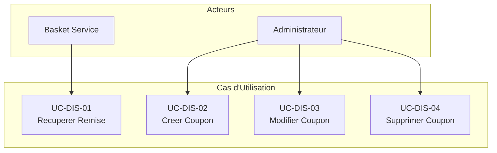

# Discount Service - Cas d'Utilisation

## Vue d'Ensemble

Le service Discount gere les coupons de reduction applicables aux produits. Il expose ses operations via gRPC (HTTP/2 + Protobuf) pour une communication inter-services performante. Il est consomme principalement par le service Basket pour appliquer les remises lors de l'ajout d'articles au panier.

## Acteurs

| Acteur | Description |
| --- | --- |
| Basket Service | Service interne consommant les remises via gRPC |
| Administrateur | Gestion des coupons (creation, modification, suppression) |

## Cas d'Utilisation

### UC-DIS-01 : Recuperer une Remise

**Acteur** : Basket Service

**Description** : Recupere les details d'un coupon de reduction pour un produit donne.

**Preconditions** : Le nom du produit doit etre fourni

**Flux Principal** :

1. Le service Basket envoie une requete gRPC `GetDiscount` avec le nom du produit
2. Le service Discount recherche le coupon dans la base de donnees SQLite
3. Le coupon est trouve et retourne au service appelant

**Reponse** :

```protobuf
CouponModel {
  id: 1,
  productName: "IPhone X",
  description: "IPhone X New",
  amount: 150.0
}
```

**Flux Alternatif** :

- 2a. Coupon non trouve : retourne une erreur gRPC `NOT_FOUND`

---

### UC-DIS-02 : Creer un Coupon

**Acteur** : Administrateur (via un service interne)

**Description** : Cree un nouveau coupon de reduction pour un produit.

**Preconditions** : Les informations du coupon doivent etre fournies

**Flux Principal** :

1. L'acteur envoie une requete gRPC `CreateDiscount` avec les details du coupon
2. Le service valide que le coupon n'est pas null
3. Le coupon est persiste dans la base de donnees SQLite
4. Le coupon cree est retourne

**Donnees Requises** :

```protobuf
CreateDiscountRequest {
  coupon: {
    productName: "string (requis)",
    description: "string",
    amount: "double (requis)"
  }
}
```

**Flux Alternatif** :

- 2a. Coupon null : retourne une erreur gRPC `INVALID_ARGUMENT`

---

### UC-DIS-03 : Modifier un Coupon

**Acteur** : Administrateur (via un service interne)

**Description** : Met a jour les details d'un coupon existant.

**Preconditions** : Le coupon doit exister (identifie par nom de produit ou ID)

**Flux Principal** :

1. L'acteur envoie une requete gRPC `UpdateDiscount` avec les nouvelles donnees
2. Le service valide que le coupon n'est pas null
3. Le service recherche le coupon par nom de produit ou ID
4. Le coupon est mis a jour et persiste
5. Le coupon modifie est retourne

**Flux Alternatif** :

- 2a. Coupon null : retourne une erreur gRPC `INVALID_ARGUMENT`
- 3a. Coupon non trouve : retourne une erreur gRPC `NOT_FOUND`

---

### UC-DIS-04 : Supprimer un Coupon

**Acteur** : Administrateur (via un service interne)

**Description** : Supprime un coupon de reduction existant.

**Preconditions** : Le coupon doit exister (identifie par nom de produit ou ID)

**Flux Principal** :

1. L'acteur envoie une requete gRPC `DeleteDiscount` avec les details du coupon
2. Le service valide que le coupon n'est pas null
3. Le service recherche le coupon par nom de produit ou ID
4. Le coupon est supprime de la base de donnees
5. Une confirmation de suppression est retournee

**Reponse** :

```protobuf
DeleteDiscountResponse {
  success: true
}
```

**Flux Alternatif** :

- 2a. Coupon null : retourne une erreur gRPC `INVALID_ARGUMENT`
- 3a. Coupon non trouve : retourne une erreur gRPC `NOT_FOUND`

---

## Diagramme des Cas d'Utilisation



## Modele de Donnees

### Coupon

```json
{
  "id": "int (identity, auto-generated)",
  "productName": "string",
  "description": "string",
  "amount": "double"
}
```

### Donnees Pre-chargees (Seed)

| Id | ProductName | Description | Amount |
| --- | --- | --- | --- |
| 1 | IPhone X | IPhone X New | 150.0 |
| 2 | Samsung 10 | Samsung 10 New | 100.0 |

## Operations gRPC

| Methode RPC | Request | Response | Description |
| --- | --- | --- | --- |
| GetDiscount | GetDiscountRequest | CouponModel | Recuperer une remise par nom de produit |
| CreateDiscount | CreateDiscountRequest | CouponModel | Creer un nouveau coupon |
| UpdateDiscount | UpdateDiscountRequest | CouponModel | Modifier un coupon existant |
| DeleteDiscount | DeleteDiscountRequest | DeleteDiscountResponse | Supprimer un coupon |
