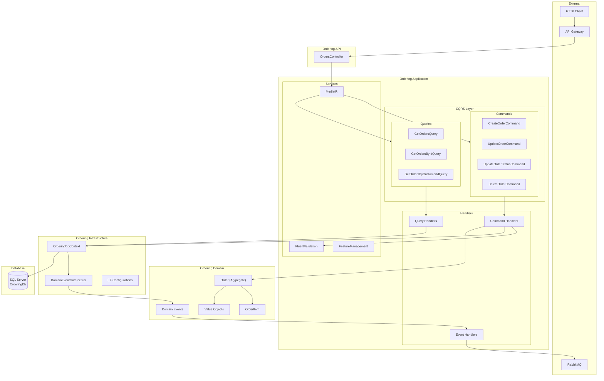
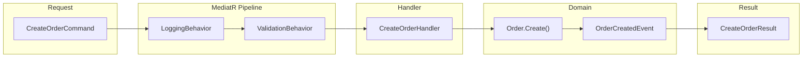
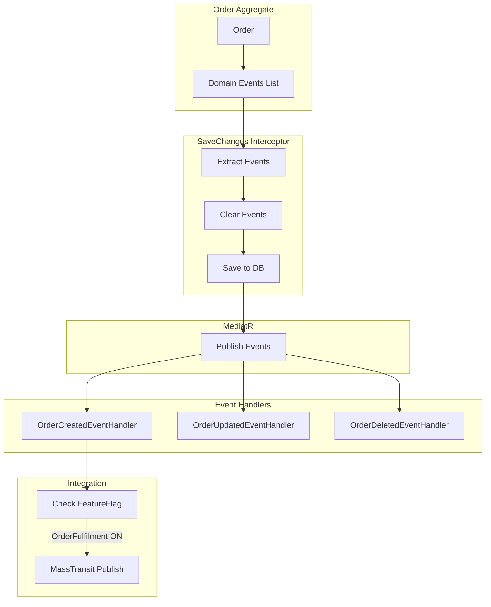
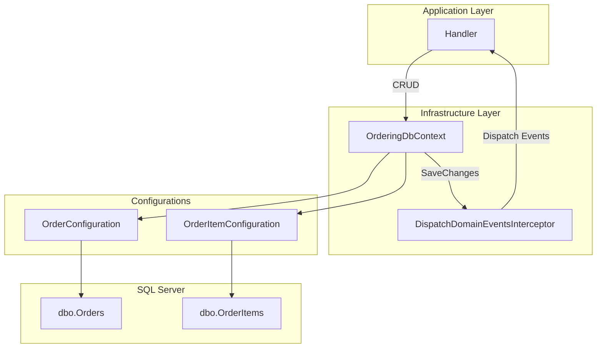
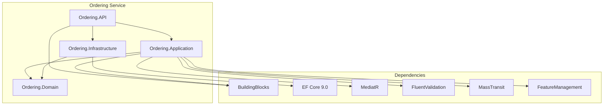

# Ordering Service - Architecture des Composants

## Vue d'Ensemble

Le Ordering Service est responsable de la gestion des commandes. Il est construit sur une architecture **Clean Architecture** avec le pattern **CQRS** (MediatR) et les principes du **Domain-Driven Design (DDD)**. Il utilise Entity Framework Core avec SQL Server.

## Architecture Globale



## Structure des Dossiers

```
Ordering/
├── Ordering.API/
│   ├── Controllers/
│   │   └── OrdersController.cs
│   ├── Program.cs
│   └── Dockerfile
├── Ordering.Application/
│   ├── Features/
│   │   └── Orders/
│   │       ├── Commands/
│   │       │   ├── CreateOrder/
│   │       │   ├── UpdateOrder/
│   │       │   ├── UpdateOrderStatus/
│   │       │   └── DeleteOrder/
│   │       ├── Queries/
│   │       │   ├── GetOrders/
│   │       │   ├── GetOrdersById/
│   │       │   └── GetOrdersByCustomerId/
│   │       ├── EventHandlers/
│   │       │   └── Domain/
│   │       ├── Dtos/
│   │       └── Mappers/
│   └── Extensions/
├── Ordering.Domain/
│   ├── Models/
│   │   ├── Order.cs
│   │   └── OrderItem.cs
│   ├── ValueObjects/
│   │   ├── Address.cs
│   │   └── Payment.cs
│   ├── Enums/
│   │   └── OrderStatus.cs
│   └── Events/
└── Ordering.Infrastructure/
    ├── Data/
    │   ├── OrderingDbContext.cs
    │   └── Interceptors/
    └── Configurations/
```

## Composants Principaux

### OrdersController

Point d'entree HTTP pour toutes les operations sur les commandes.

```csharp
[ApiController]
[Route("[controller]")]
public class OrdersController(ISender sender) : ControllerBase
{
    // GET /orders
    // GET /orders/{orderId}
    // GET /orders/customer/{customerId}
    // POST /orders
    // PUT /orders
    // PUT /orders/{orderId}  (update status)
    // DELETE /orders/{orderId}
}
```

### Modele Order (Aggregate Root)

```csharp
public class Order : Aggregate<OrderId>
{
    public CustomerId CustomerId { get; private set; }
    public OrderName OrderName { get; private set; }
    public Address ShippingAddress { get; private set; }
    public Address BillingAddress { get; private set; }
    public Payment Payment { get; private set; }
    public OrderStatus OrderStatus { get; private set; }

    private readonly List<OrderItem> _orderItems = [];
    public IReadOnlyList<OrderItem> OrderItems => _orderItems.AsReadOnly();

    public decimal TotalPrice => OrderItems.Sum(x => x.Price * x.Quantity);

    // Factory method
    public static Order Create(CustomerId customerId, OrderName orderName,
        Address shippingAddress, Address billingAddress, Payment payment)

    // Domain methods
    public void AddOrderItem(ProductId productId, int quantity, decimal price)
    public void RemoveOrderItem(ProductId productId)
    public void Update(OrderName name, Address shipping, Address billing, Payment payment, OrderStatus status)
    public void UpdateStatus(OrderStatus status)
}
```

### Modele OrderItem

```csharp
public class OrderItem : Entity<OrderItemId>
{
    public OrderId OrderId { get; private set; }
    public ProductId ProductId { get; private set; }
    public int Quantity { get; private set; }
    public decimal Price { get; private set; }
}
```

### Value Objects

#### Address

```csharp
public record Address
{
    public string FirstName { get; }
    public string LastName { get; }
    public string EmailAddress { get; }
    public string AddressLine { get; }
    public string Country { get; }
    public string State { get; }
    public string ZipCode { get; }

    public static Address Of(string firstName, string lastName, string email,
        string addressLine, string country, string state, string zipCode)
}
```

#### Payment

```csharp
public record Payment
{
    public string CardName { get; }
    public string CardNumber { get; }
    public string Expiration { get; }
    public string CVV { get; }        // Valide: 3 chiffres
    public int PaymentMethod { get; }

    public static Payment Of(string cardName, string cardNumber,
        string expiration, string cvv, int paymentMethod)
}
```

### OrderStatus (Enum)

```csharp
public enum OrderStatus
{
    Draft = 1,
    Pending,
    Submitted,
    Cancelled,
    Confirmed,
    Completed,
    Shipped,
    Delivered
}
```

## Commands et Handlers

### CreateOrderCommand



| Propriete       | Type           | Requis | Validation          |
| --------------- | -------------- | ------ | ------------------- |
| CustomerId      | Guid           | Oui    | Non vide            |
| OrderName       | string         | Oui    | Non vide            |
| ShippingAddress | AddressDto     | Oui    | Adresse valide      |
| BillingAddress  | AddressDto     | Oui    | Adresse valide      |
| Payment         | PaymentDto     | Oui    | CVV 3 chiffres      |
| OrderItems      | List<ItemDto>  | Oui    | Au moins 1 item     |

### UpdateOrderCommand

| Propriete       | Type           | Requis | Validation          |
| --------------- | -------------- | ------ | ------------------- |
| Id              | Guid           | Oui    | Commande existante  |
| CustomerId      | Guid           | Oui    | Non vide            |
| OrderName       | string         | Oui    | Non vide            |
| ShippingAddress | AddressDto     | Oui    | Adresse valide      |
| BillingAddress  | AddressDto     | Oui    | Adresse valide      |
| Payment         | PaymentDto     | Oui    | CVV 3 chiffres      |
| OrderStatus     | OrderStatus    | Oui    | Statut valide       |
| OrderItems      | List<ItemDto>  | Oui    | Au moins 1 item     |

### UpdateOrderStatusCommand

| Propriete | Type        | Requis | Validation         |
| --------- | ----------- | ------ | ------------------ |
| OrderId   | Guid        | Oui    | Commande existante |
| Status    | OrderStatus | Oui    | Statut valide      |

### DeleteOrderCommand

| Propriete | Type | Requis | Validation         |
| --------- | ---- | ------ | ------------------ |
| OrderId   | Guid | Oui    | Commande existante |

## Queries et Handlers

### GetOrdersQuery

| Propriete  | Type | Defaut |
| ---------- | ---- | ------ |
| PageNumber | int  | 1      |
| PageSize   | int  | 10     |

**Resultat** : `GetOrdersResponse` avec `IEnumerable<OrderDto>`

### GetOrdersByIdQuery

| Propriete | Type | Requis |
| --------- | ---- | ------ |
| OrderId   | Guid | Oui    |

**Resultat** : `GetOrdersByIdResponse` avec `OrderDto` ou `NotFoundException`

### GetOrdersByCustomerIdQuery

| Propriete  | Type | Requis |
| ---------- | ---- | ------ |
| CustomerId | Guid | Oui    |

**Resultat** : `IEnumerable<OrderDto>`

## Domain Events



| Event              | Declencheur                        | Handler                    |
| ------------------ | ---------------------------------- | -------------------------- |
| OrderCreatedEvent  | `Order.Create()`                   | OrderCreatedEventHandler   |
| OrderUpdatedEvent  | `Order.Update()`, `UpdateStatus()` | OrderUpdatedEventHandler   |
| OrderDeletedEvent  | `DeleteOrderCommand`               | OrderDeletedEventHandler   |

## Integration avec Entity Framework Core



### Operations EF Core

| Operation | Methode                              | Description                |
| --------- | ------------------------------------ | -------------------------- |
| Create    | `context.Orders.Add(order)`          | Ajoute une commande        |
| Read      | `context.Orders.FirstOrDefaultAsync` | Charge par ID              |
| Query     | `context.Orders.Include().Where()`   | Requete avec includes      |
| Update    | Modification de l'entite trackee     | Detecte les changements    |
| Delete    | `context.Orders.Remove(order)`       | Supprime la commande       |
| Save      | `context.SaveChangesAsync()`         | Commit + dispatch events   |

## Dependances



## Configuration

### appsettings.json

```json
{
  "ConnectionStrings": {
    "OrderingConnection": "Server=...;Database=OrderingDb;..."
  },
  "FeatureManagement": {
    "OrderFulfilment": true
  }
}
```

### Program.cs (Services)

```csharp
// Application Services
builder.Services.AddApplicationServices(configuration);

// Infrastructure Services
builder.Services.AddInfrastructureServices(configuration);

// MediatR avec Behaviors
services.AddMediatR(cfg =>
{
    cfg.RegisterServicesFromAssembly(assembly);
    cfg.AddOpenBehavior(typeof(ValidationBehavior<,>));
    cfg.AddOpenBehavior(typeof(LoggingBehavior<,>));
});

// Feature Management
services.AddFeatureManagement();

// Message Broker (MassTransit + RabbitMQ)
services.AddMessageBroker(configuration, assembly);
```
