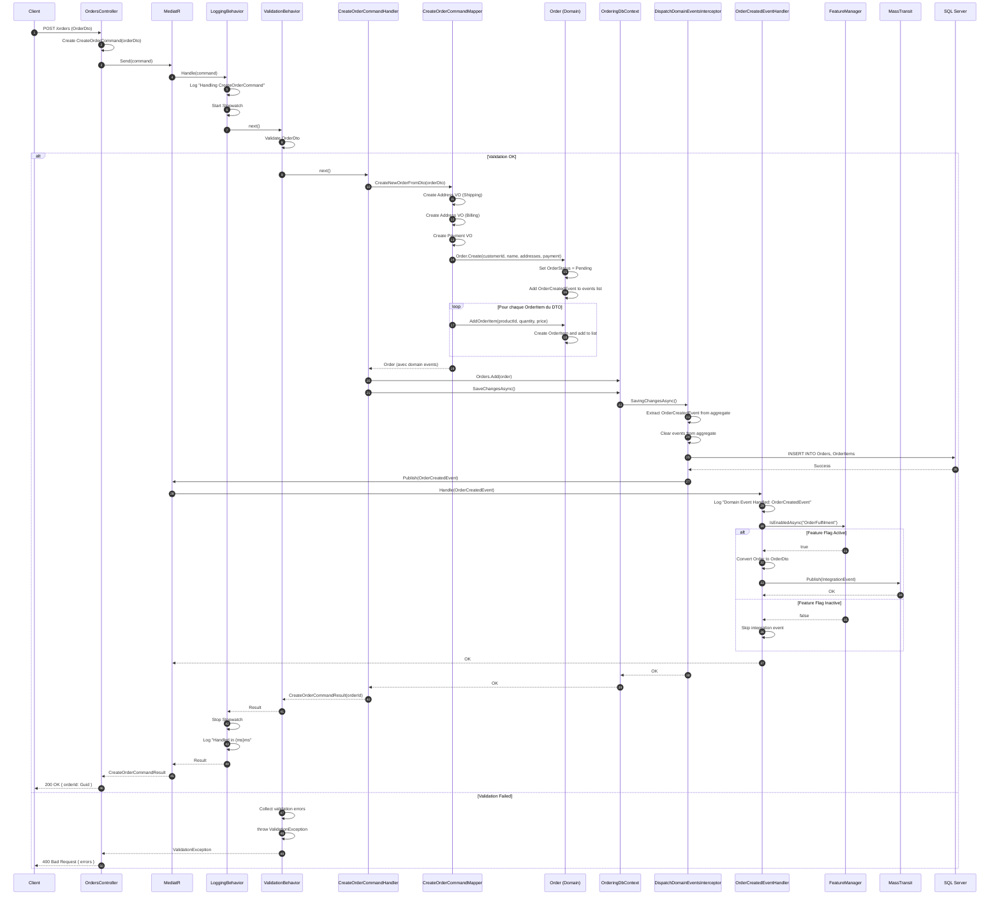
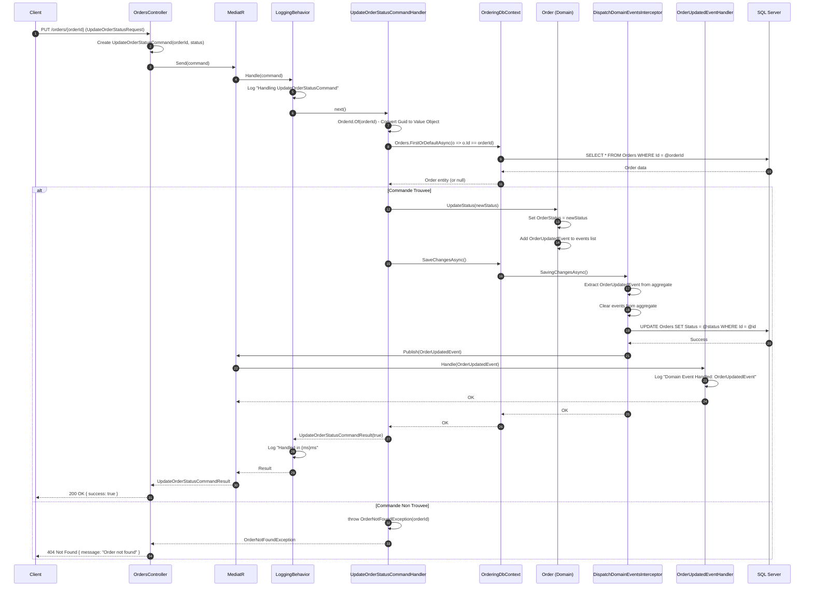
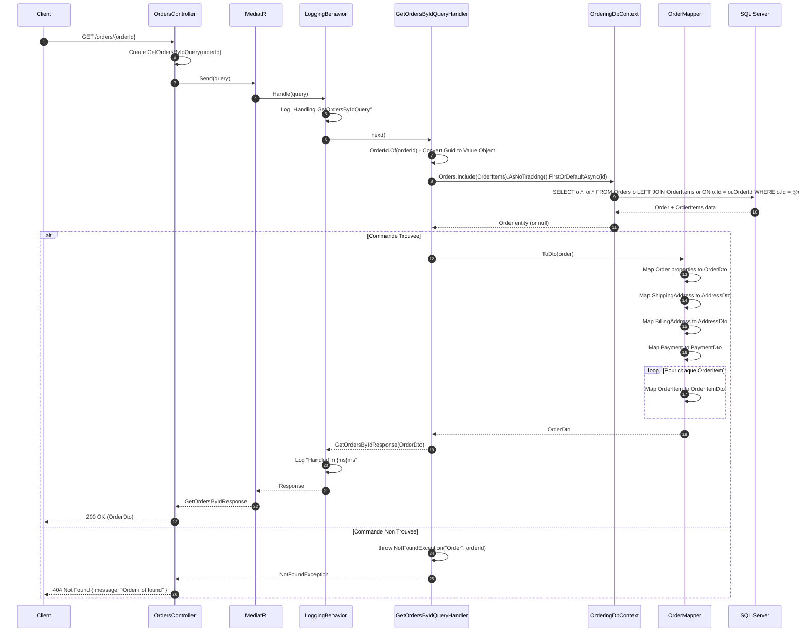
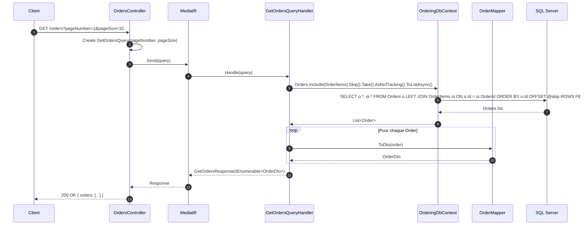
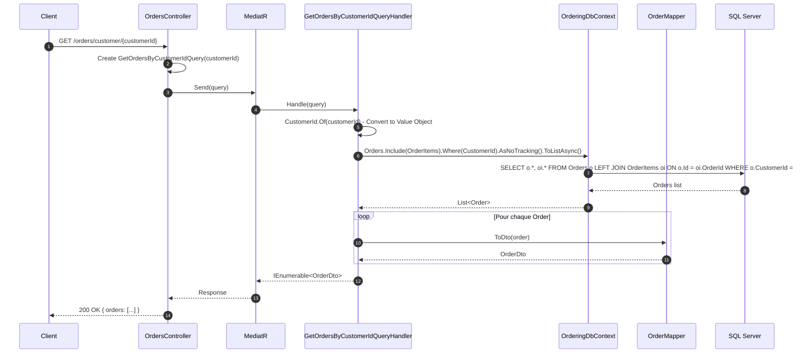
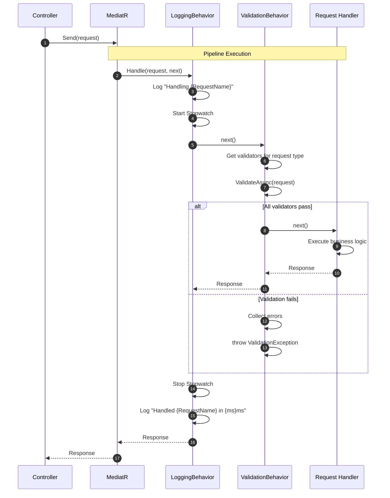
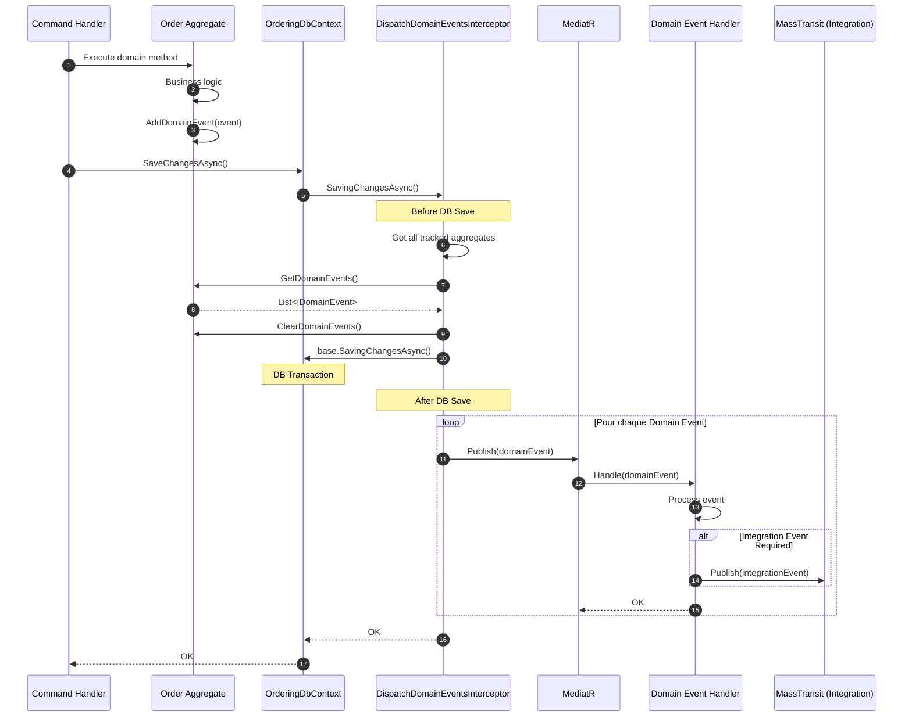

# Ordering Service - Diagrammes de Sequence

## Vue d'Ensemble

Ce document presente les diagrammes de sequence pour les principales operations du service Ordering.

## Operations d'Ecriture

### POST /orders - Creation d'une Commande



### PUT /orders/{orderId} - Changement du Statut d'une Commande



## Operations de Lecture

### GET /orders/{orderId} - Recuperation des Informations d'une Commande



### GET /orders - Liste Paginee des Commandes



### GET /orders/customer/{customerId} - Commandes par Client



## Operations de Suppression

### DELETE /orders/{orderId} - Suppression d'une Commande

```mermaid
sequenceDiagram
    autonumber
    participant Client
    participant Controller as OrdersController
    participant Mediator as MediatR
    participant Handler as DeleteOrderCommandHandler
    participant DbContext as OrderingDbContext
    participant Order as Order (Domain)
    participant Interceptor as DispatchDomainEventsInterceptor
    participant EventHandler as OrderDeletedEventHandler
    participant DB as SQL Server

    Client->>Controller: DELETE /orders/{orderId}
    Controller->>Controller: Create DeleteOrderCommand(orderId)
    Controller->>Mediator: Send(command)

    Mediator->>Handler: Handle(command)

    Handler->>Handler: OrderId.Of(orderId) - Convert to Value Object

    Handler->>DbContext: Orders.FirstOrDefaultAsync(id)
    DbContext->>DB: SELECT * FROM Orders WHERE Id = @orderId
    DB-->>DbContext: Order data
    DbContext-->>Handler: Order entity (or null)

    alt Commande Trouvee
        Handler->>Order: AddDomainEvent(new OrderDeletedEvent(order))
        Order->>Order: Add OrderDeletedEvent to events list

        Handler->>DbContext: Orders.Remove(order)
        Handler->>DbContext: SaveChangesAsync()

        DbContext->>Interceptor: SavingChangesAsync()
        Interceptor->>Interceptor: Extract OrderDeletedEvent from aggregate
        Interceptor->>Interceptor: Clear events from aggregate

        Interceptor->>DB: DELETE FROM OrderItems WHERE OrderId = @id; DELETE FROM Orders WHERE Id = @id
        DB-->>Interceptor: Success

        Interceptor->>Mediator: Publish(OrderDeletedEvent)
        Mediator->>EventHandler: Handle(OrderDeletedEvent)
        EventHandler->>EventHandler: Log "Domain Event Handled: OrderDeletedEvent"
        EventHandler-->>Mediator: OK

        Interceptor-->>DbContext: OK
        DbContext-->>Handler: OK

        Handler-->>Mediator: DeleteOrderCommandResult(true)
        Mediator-->>Controller: Result
        Controller-->>Client: 200 OK { success: true }

    else Commande Non Trouvee
        Handler->>Handler: throw OrderNotFoundException(orderId)
        Handler-->>Controller: OrderNotFoundException
        Controller-->>Client: 404 Not Found
    end
```

## Pipeline MediatR



## Flux des Domain Events


