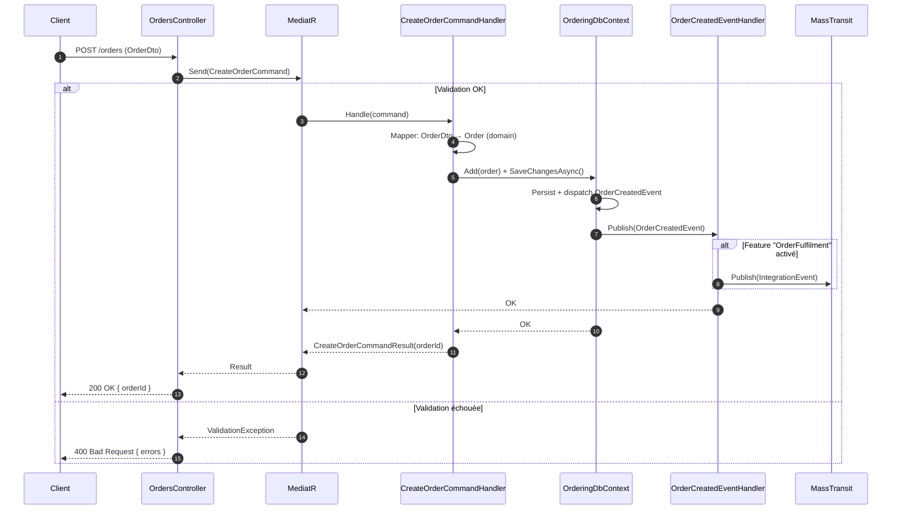
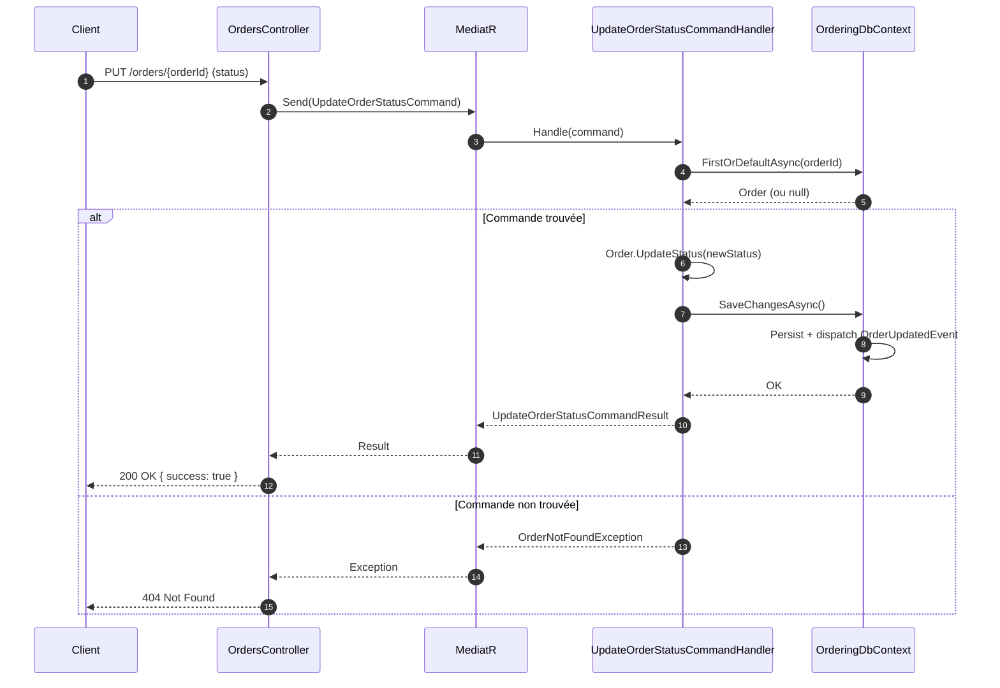
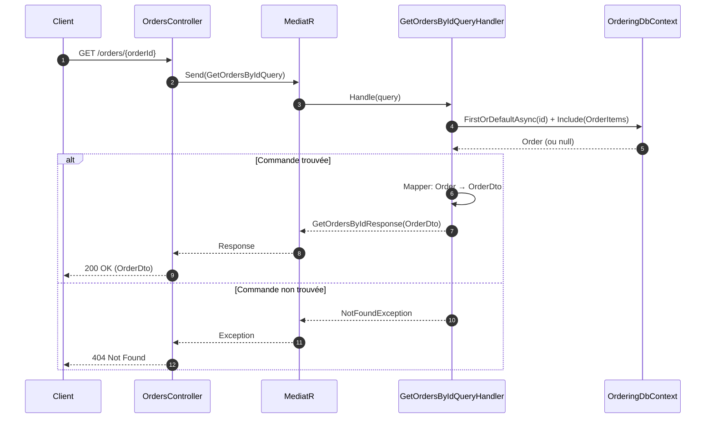
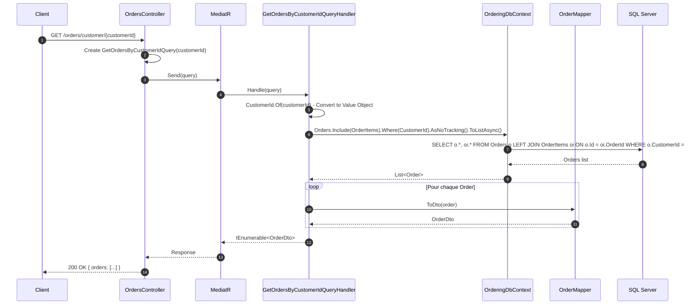
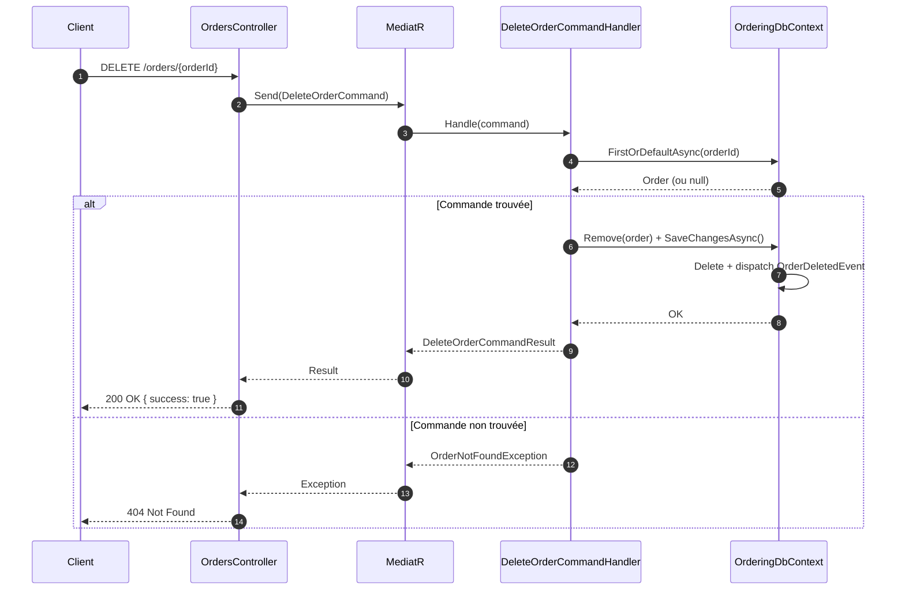

# Ordering Service - Diagrammes de Sequence

## Vue d'Ensemble

Ce document presente les diagrammes de sequence pour les principales operations du service Ordering.

## Operations d'Ecriture

### POST /orders - Creation d'une Commande



### PUT /orders/{orderId} - Changement du Statut d'une Commande



## Operations de Lecture

### GET /orders/{orderId} - Recuperation des Informations d'une Commande



### GET /orders - Liste Paginee des Commandes

```mermaid
sequenceDiagram
    autonumber
    participant Client
    participant Controller as OrdersController
    participant Mediator as MediatR
    participant Handler as GetOrdersQueryHandler
    participant DbContext as OrderingDbContext

    Client->>Controller: GET /orders?pageNumber=1&pageSize=10
    Controller->>Mediator: Send(GetOrdersQuery)

    Mediator->>Handler: Handle(query)
    Handler->>DbContext: ToListAsync() + pagination (Skip/Take)
    DbContext-->>Handler: List&lt;Order&gt;
    Handler->>Handler: Mapper: Order → OrderDto (pour chaque)
    Handler-->>Mediator: GetOrdersResponse(OrderDto[])
    Mediator-->>Controller: Response
    Controller-->>Client: 200 OK { orders }
```

### GET /orders/customer/{customerId} - Commandes par Client



## Operations de Suppression

### DELETE /orders/{orderId} - Suppression d'une Commande


