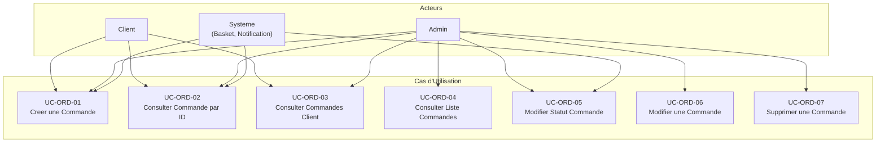
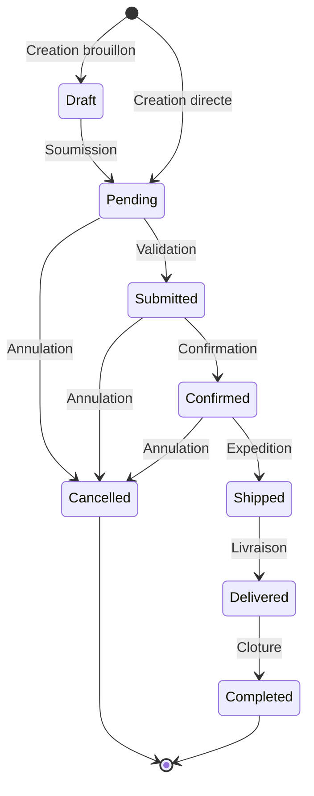

# Ordering Service - Cas d'Utilisation

## Vue d'Ensemble

Le service Ordering gere les commandes de la plateforme e-commerce. Il permet de creer, consulter, modifier le statut et supprimer des commandes.

## Acteurs

| Acteur  | Description                                    |
| ------- | ---------------------------------------------- |
| Client  | Utilisateur passant des commandes              |
| Admin   | Administrateur gerant les commandes            |
| Systeme | Services internes (Basket, Notification, etc.) |

## Cas d'Utilisation

### UC-ORD-01 : Creer une Commande

**Acteur** : Client, Systeme (Basket)

**Description** : Permet de creer une nouvelle commande avec les informations de livraison, facturation et paiement.

**Preconditions** :
- Le client doit etre identifie (CustomerId valide)
- Au moins un article doit etre present dans la commande

**Flux Principal** :

1. L'acteur envoie une requete POST /orders avec les donnees de la commande
2. Le systeme valide les donnees (adresses, paiement, articles)
3. Le systeme cree la commande avec le statut "Pending"
4. Le systeme declenche l'evenement OrderCreatedEvent
5. Le systeme publie un evenement d'integration (si feature flag actif)
6. Le systeme retourne l'ID de la commande creee

**Donnees Requises** :

```json
{
  "customerId": "guid (requis)",
  "orderName": "string (requis)",
  "shippingAddress": {
    "firstName": "string (requis)",
    "lastName": "string (requis)",
    "emailAddress": "string (requis)",
    "addressLine": "string (requis)",
    "country": "string (requis)",
    "state": "string (requis)",
    "zipCode": "string (requis)"
  },
  "billingAddress": { ... },
  "payment": {
    "cardName": "string (requis)",
    "cardNumber": "string (requis)",
    "expiration": "string (requis)",
    "cvv": "string (requis, 3 chiffres)",
    "paymentMethod": "int (requis)"
  },
  "orderItems": [
    {
      "productId": "guid (requis)",
      "quantity": "int (requis, > 0)",
      "price": "decimal (requis, > 0)"
    }
  ]
}
```

**Flux Alternatif** :

- 2a. Validation echouee : retourne 400 Bad Request avec les erreurs

**Postconditions** :
- La commande est creee avec le statut "Pending"
- L'evenement OrderCreatedEvent est publie
- Si le feature flag "OrderFulfilment" est actif, un evenement d'integration est envoye

---

### UC-ORD-02 : Consulter une Commande par ID

**Acteur** : Client, Admin, Systeme

**Description** : Permet de recuperer les details complets d'une commande specifique.

**Preconditions** : La commande doit exister

**Flux Principal** :

1. L'acteur envoie une requete GET /orders/{orderId}
2. Le systeme recherche la commande avec ses articles
3. Le systeme retourne les details de la commande

**Reponse** :

```json
{
  "id": "guid",
  "customerId": "guid",
  "orderName": "string",
  "shippingAddress": { ... },
  "billingAddress": { ... },
  "payment": { ... },
  "orderStatus": "Pending|Submitted|...",
  "orderItems": [
    {
      "orderId": "guid",
      "productId": "guid",
      "quantity": 2,
      "price": 99.99
    }
  ]
}
```

**Flux Alternatif** :

- 2a. Commande non trouvee : retourne 404 Not Found

---

### UC-ORD-03 : Consulter les Commandes d'un Client

**Acteur** : Client, Admin

**Description** : Permet de recuperer toutes les commandes d'un client specifique.

**Preconditions** : Aucune

**Flux Principal** :

1. L'acteur envoie une requete GET /orders/customer/{customerId}
2. Le systeme recherche toutes les commandes du client
3. Le systeme retourne la liste des commandes

**Flux Alternatif** :

- 2a. Aucune commande trouvee : retourne une liste vide

---

### UC-ORD-04 : Consulter la Liste des Commandes

**Acteur** : Admin

**Description** : Permet de recuperer la liste paginee de toutes les commandes.

**Preconditions** : Aucune

**Flux Principal** :

1. L'acteur envoie une requete GET /orders
2. Le systeme recupere les commandes avec pagination
3. Le systeme retourne la liste paginee

**Parametres** :

- `pageNumber` (optionnel) : Numero de page (defaut: 1)
- `pageSize` (optionnel) : Taille de page (defaut: 10)

**Reponse** :

```json
{
  "orders": [...]
}
```

---

### UC-ORD-05 : Modifier le Statut d'une Commande

**Acteur** : Admin, Systeme

**Description** : Permet de changer le statut d'une commande existante.

**Preconditions** :
- La commande doit exister
- Le nouveau statut doit etre valide

**Flux Principal** :

1. L'acteur envoie une requete PUT /orders/{orderId} avec le nouveau statut
2. Le systeme recherche la commande
3. Le systeme met a jour le statut
4. Le systeme declenche l'evenement OrderUpdatedEvent
5. Le systeme retourne confirmation

**Donnees Requises** :

```json
{
  "status": "Submitted|Cancelled|Confirmed|Completed|Shipped|Delivered"
}
```

**Statuts Disponibles** :

| Statut    | Valeur | Description                      |
| --------- | ------ | -------------------------------- |
| Draft     | 1      | Brouillon                        |
| Pending   | 2      | En attente de traitement         |
| Submitted | 3      | Soumise                          |
| Cancelled | 4      | Annulee                          |
| Confirmed | 5      | Confirmee                        |
| Completed | 6      | Terminee                         |
| Shipped   | 7      | Expediee                         |
| Delivered | 8      | Livree                           |

**Flux Alternatif** :

- 2a. Commande non trouvee : retourne 404 Not Found

**Postconditions** :
- Le statut de la commande est mis a jour
- L'evenement OrderUpdatedEvent est publie

---

### UC-ORD-06 : Modifier une Commande

**Acteur** : Admin

**Description** : Permet de modifier les informations d'une commande existante.

**Preconditions** :
- La commande doit exister
- Les nouvelles donnees doivent etre valides

**Flux Principal** :

1. L'acteur envoie une requete PUT /orders avec les nouvelles donnees
2. Le systeme valide les donnees
3. Le systeme met a jour la commande
4. Le systeme declenche l'evenement OrderUpdatedEvent
5. Le systeme retourne confirmation

**Flux Alternatif** :

- 2a. Validation echouee : retourne 400 Bad Request
- 2b. Commande non trouvee : retourne 404 Not Found

---

### UC-ORD-07 : Supprimer une Commande

**Acteur** : Admin

**Description** : Permet de supprimer une commande du systeme.

**Preconditions** :
- La commande doit exister

**Flux Principal** :

1. L'acteur envoie une requete DELETE /orders/{orderId}
2. Le systeme verifie l'existence de la commande
3. Le systeme supprime la commande et ses articles
4. Le systeme declenche l'evenement OrderDeletedEvent
5. Le systeme retourne confirmation

**Flux Alternatif** :

- 2a. Commande non trouvee : retourne 404 Not Found

**Postconditions** :
- La commande et ses articles sont supprimes
- L'evenement OrderDeletedEvent est publie

---

## Diagramme des Cas d'Utilisation



## Matrice des Droits

| Cas d'Utilisation | Client | Admin | Systeme |
| ----------------- | ------ | ----- | ------- |
| UC-ORD-01 Creer   | X      | X     | X       |
| UC-ORD-02 Consulter par ID | X | X | X     |
| UC-ORD-03 Consulter par Client | X | X | - |
| UC-ORD-04 Liste paginee | - | X    | -       |
| UC-ORD-05 Modifier statut | - | X  | X       |
| UC-ORD-06 Modifier | -     | X     | -       |
| UC-ORD-07 Supprimer | -    | X     | -       |

## Cycle de Vie d'une Commande



## Evenements Declenches

| Cas d'Utilisation | Evenement Domain    | Integration Event |
| ----------------- | ------------------- | ----------------- |
| UC-ORD-01 Creer   | OrderCreatedEvent   | Oui (si flag)     |
| UC-ORD-05 Statut  | OrderUpdatedEvent   | Non               |
| UC-ORD-06 Modifier| OrderUpdatedEvent   | Non               |
| UC-ORD-07 Supprimer| OrderDeletedEvent  | Non               |
